# Orion Mobile, l'app Android

Orion Mobile è il telefono in tasca di chi agisce: il volontario in squadra, il
magazziniere che consegna, la segreteria fuori sede. Parla con lo stesso
server del web e vede gli stessi dati. Per il lavoro in sala operativa c'è il
[manuale del web](manuale-web.md).

Le immagini vengono da un gruppo di prova, il "Gruppo Comunale di Protezione
Civile", con persone e dati inventati. Come sul web, ognuno vede solo le voci
del suo ruolo.

## 1. Installare ed entrare

L'app non sta nel Play Store: la distribuisce l'associazione dal proprio
server. Dal browser del telefono, dopo l'accesso al web, ORION propone
"Scarica l'app" e spiega i passi: scaricare `orion.apk`, aprirlo dalla
notifica, consentire una volta l'installazione da quella fonte, toccare
"Installa".

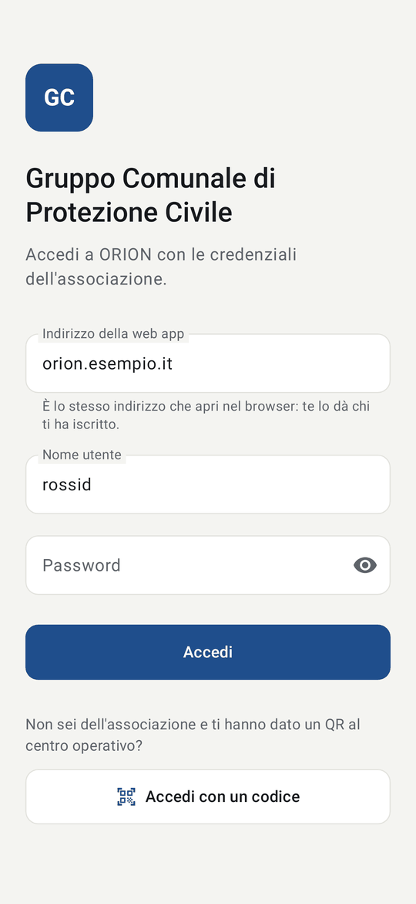

Al primo avvio si scrivono l'indirizzo della web app (lo stesso del browser),
il nome utente e la password. Chi ha la verifica in due passaggi scrive anche
il codice a sei cifre. Subito dopo l'app propone di entrare la volta dopo con
l'**impronta**: conviene accettare, e la password non resta sul telefono.

Chi non è dell'associazione e ha ricevuto un QR dal centro operativo usa
**Accedi con un codice** e inquadra il QR.

Poi l'app chiede i permessi, uno alla volta: le **notifiche** (per sapere quando
si viene chiamati o mandati su un intervento), la **fotocamera** (foto e
documenti) e la **posizione**, da concedere come "Consenti sempre": così la
sala vede la squadra anche con il telefono in tasca.

## 2. La schermata principale

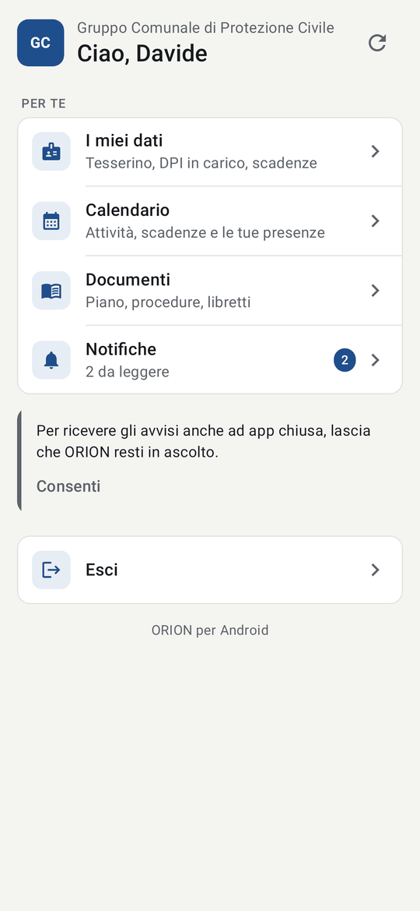

In alto il nome dell'associazione e il saluto; il pulsante tondo aggiorna. Le
voci sono divise in due gruppi.

| Voce | Cosa contiene | Chi la vede |
|---|---|---|
| Le mie attività | Gli incarichi della propria funzione di supporto | Chi è in una funzione, durante l'emergenza |
| Regia: osservazioni | Gli appunti della regia in una simulazione | La regia, a sala aperta |
| I miei dati | Tesserino, DPI in carico, visite, corsi, profilo | Tutti gli interni |
| Calendario | Attività, convocazioni, presenze, assenze | Tutti gli interni |
| Documenti | Piano, procedure, libretti | Tutti |
| Notifiche | Gli avvisi ricevuti | Tutti |
| Consegna materiale | Consegna a una persona | Chi consegna |
| Rientro materiale | Il materiale che torna in magazzino | Chi consegna |
| Magazzino | Inventario, scadenze, chi ha cosa, registro | Chi gestisce il magazzino |
| Segreteria | Scadenze, fascicoli, visite e corsi | Chi gestisce visite e corsi |
| Esci | Esce dall'app e ferma gli avvisi | Tutti |

Sotto le voci, un riquadro segnala quello che va sistemato: per esempio la
posizione non concessa "sempre", o gli avvisi da attivare. Toccandolo si arriva
dove si sistema.

## 3. L'emergenza

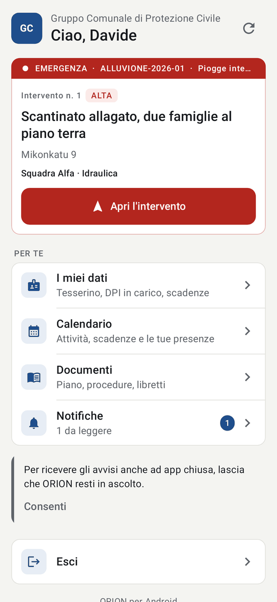

L'emergenza compare solo a chi è in una squadra. In cima c'è la fascia rossa con
il codice; sotto, il riquadro dell'intervento della propria squadra, con
"Apri".

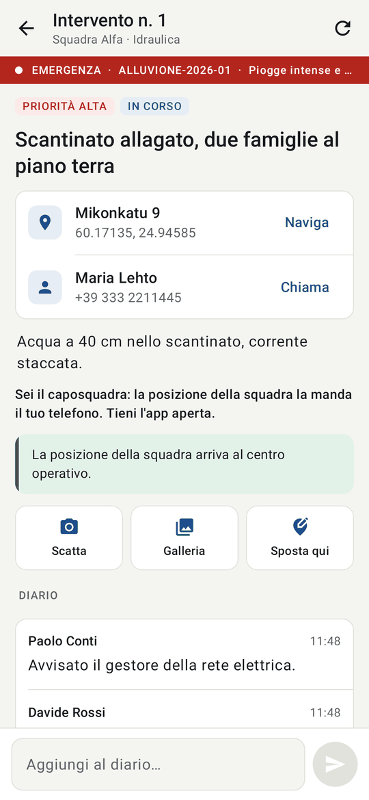

La schermata dell'intervento dice tutto quello che serve sul posto: priorità e
stato, l'indirizzo con **Naviga** (apre il navigatore), chi ha chiamato con
**Chiama**, la descrizione, i rischi e il diario. **Scatta** e **Galleria**
aggiungono foto; **Sposta qui** corregge il punto sulla mappa con la posizione
del telefono. In fondo si scrive nel diario. Note e foto partono anche senza
rete: restano in coda e arrivano appena torna il campo.

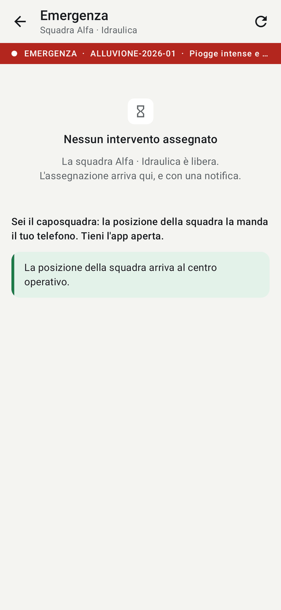

Quando la squadra è libera la schermata lo dice e aspetta. L'assegnazione
arriva con una notifica.

**La posizione.** Mentre si è in squadra l'app manda la posizione alla sala.
Se c'è un caposquadra la manda il suo telefono; se tace per qualche minuto
subentra quello di un altro membro. Smette da sola uscendo dalla squadra o alla
chiusura dell'emergenza.

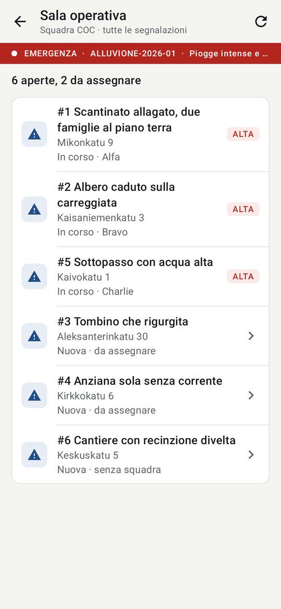

**Chi è in sala** (squadra COC) vede dal telefono tutte le segnalazioni aperte,
le apre, legge il diario e scrive note: utile al coordinatore che va sul campo.

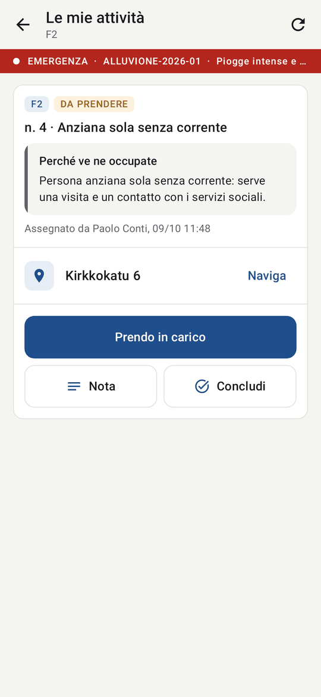

**Le mie attività** è per chi fa parte di una funzione di supporto. Ogni
incarico dice perché è stato dato e dove: **Prendo in carico**, **Nota** (scrive
nel diario con la sigla della funzione) e **Concludi** con l'esito. Qui serve la
rete.

## 4. La chiamata della sala

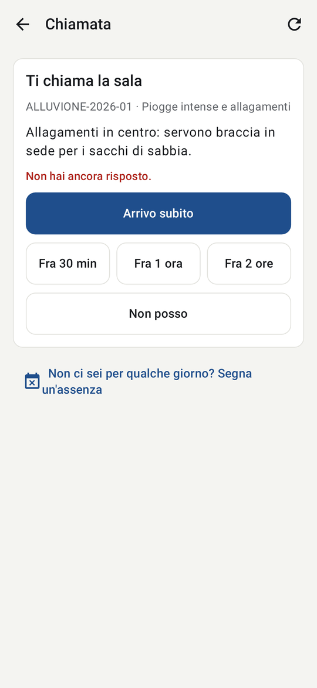

Quando la sala chiama i volontari arriva una notifica d'emergenza che apre
questa schermata, con il messaggio della sala. Si risponde con un tocco:
**Arrivo subito**, **Fra 30 min**, **Fra 1 ora**, **Fra 2 ore** o **Non posso**.

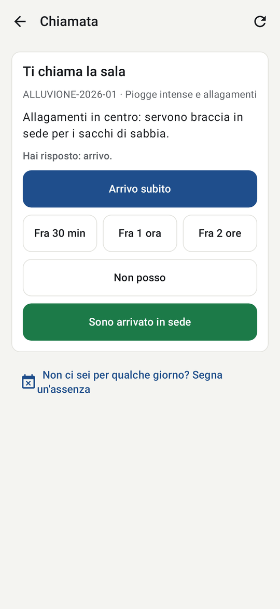

Dopo la risposta, arrivati in sede si tocca **Sono arrivato in sede**. La
risposta si cambia finché non si è arrivati.

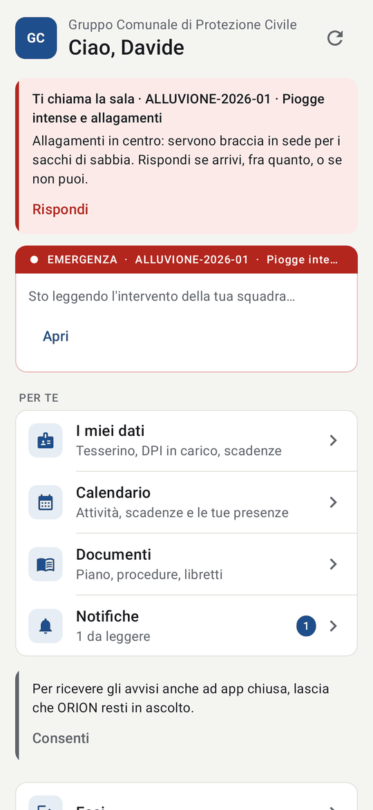

Finché non si risponde, la chiamata resta in cima alla schermata principale.

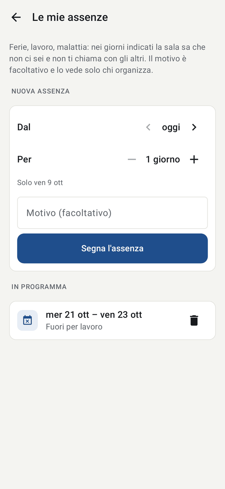

**Le mie assenze** (dalla chiamata o dal calendario) segna i giorni in cui non
ci sei: le frecce spostano il primo giorno, più e meno dicono per quanti
giorni. In quei giorni le chiamate generali non ti arrivano.

## 5. Il calendario

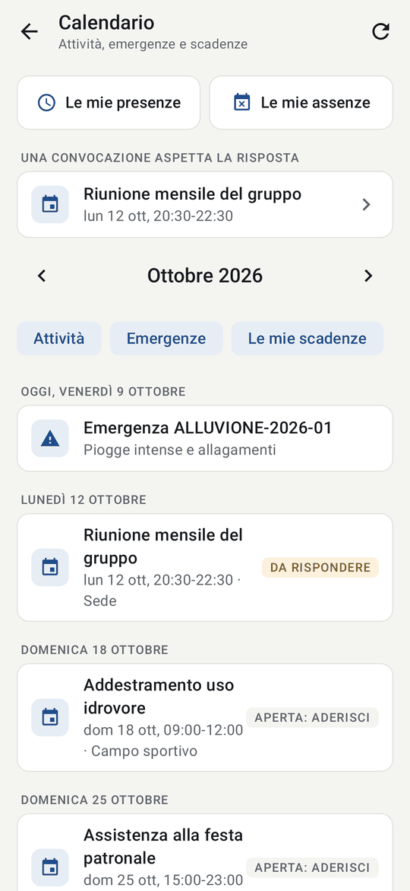

L'agenda giorno per giorno, con le frecce per cambiare mese e i filtri. In cima
le convocazioni che aspettano risposta. **Le mie presenze** e **Le mie assenze**
stanno sotto il titolo.

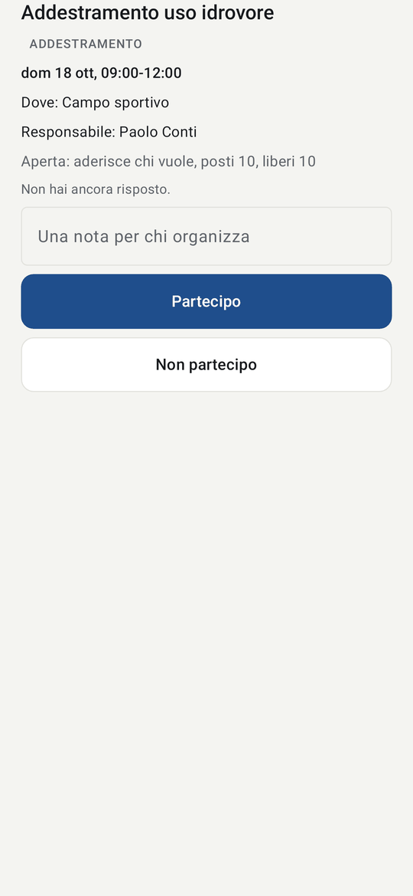

Toccando un'attività si leggono i dettagli e si risponde **Partecipo** o **Non
partecipo**, con una nota facoltativa per chi organizza.

Dopo aver risposto di sì compare **Aggiungi al calendario del telefono**: si
apre l'app del calendario con titolo, orari, luogo e note già scritti, e
l'evento si salva nel calendario che si preferisce. ORION non chiede il
permesso sul calendario e non lo legge: se poi l'attività cambia o viene
annullata, l'evento sul telefono va corretto a mano. Il pulsante resta finché
l'attività non è finita.

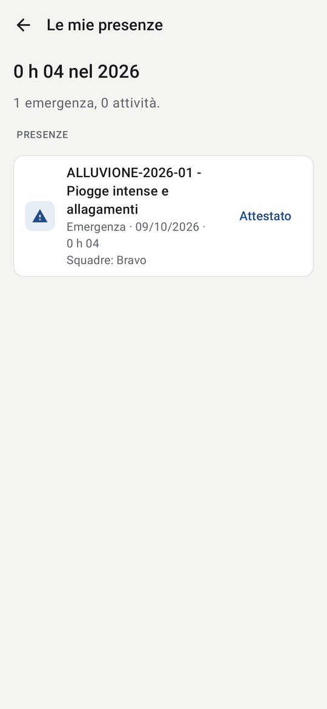

**Le mie presenze** mostra le ore dell'anno, in attività e in emergenza, con
l'**Attestato** in PDF da dare al datore di lavoro.

## 6. I miei dati

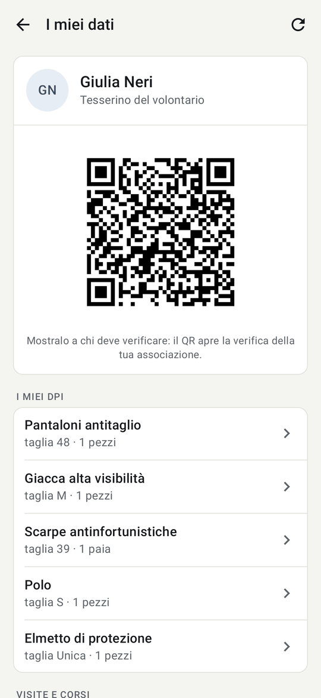

È il fascicolo in tasca. In alto il **tesserino** con il QR, che funziona anche
senza rete. Sotto i **DPI** in carico e, dopo l'impronta o il PIN del telefono,
le **visite** e i **corsi** (sono dati sanitari). Se il magazzino chiede la
conferma di una consegna, qui compare "Da confermare": confermare vale come
firma.

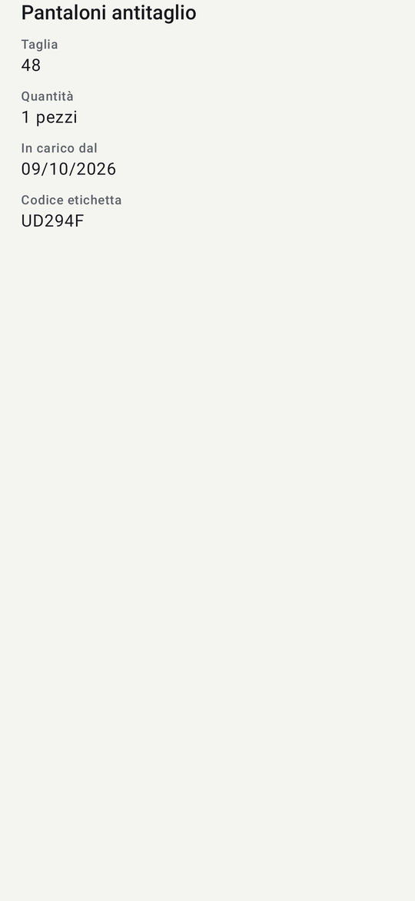

Toccando un DPI se ne vedono taglia, quantità, data di consegna, codice
dell'etichetta e scadenza. Toccando un corso, l'attestato si apre o si salva in
Download.

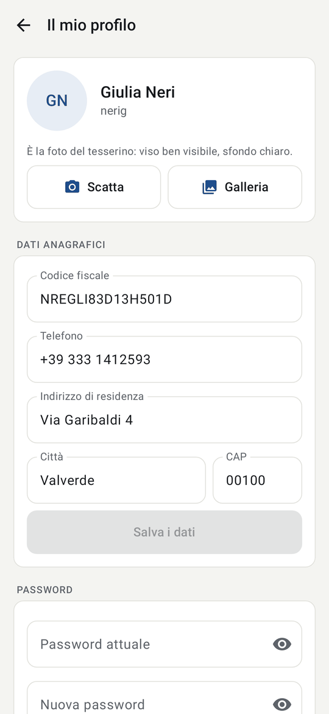

Da I miei dati si apre **Il mio profilo**: la foto del tesserino (scattata o
dalla galleria, da inquadrare nell'ovale), i dati anagrafici, la password, il
fascicolo in PDF e gli avvisi sul telefono. Cambiando la password gli altri
dispositivi devono rientrare.

## 7. Notifiche e avvisi

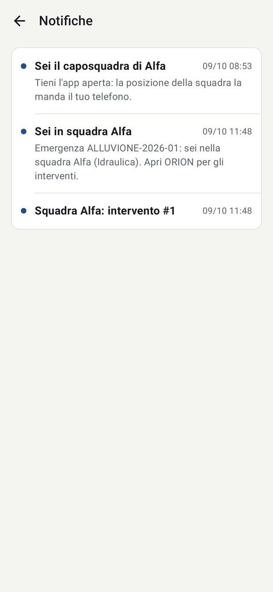

Le notifiche arrivano in quattro gruppi: **Emergenza** (ingresso in squadra,
intervento assegnato, chiamata), **Per te** (DPI da confermare, proprie
scadenze), **Segreteria** e **Magazzino** (i riepiloghi del mattino, per chi ha
quei ruoli). Ogni gruppo è un canale di Android, che si può silenziare senza
perdere gli altri. Toccando una notifica si arriva dove la cosa si guarda.

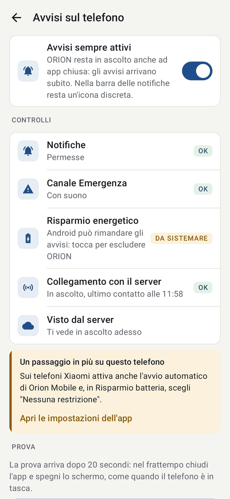

Perché gli avvisi arrivino anche ad app chiusa, l'app resta in ascolto del
server (un'icona discreta fra le notifiche). Se l'associazione usa Firebase,
l'icona non c'è: il telefono viene svegliato a ogni avviso e la schermata
dice "Avvisi con Firebase". Non c'è niente da fare: l'app passa da sola a
Firebase e torna indietro se l'associazione lo spegne. La schermata **Avvisi sul
telefono** controlla tutto quello che serve: permesso delle notifiche, canale
Emergenza non silenziato, risparmio energetico, collegamento con il server.
Ogni voce da sistemare si tocca e porta dove si sistema. **Manda una prova** fa
arrivare una notifica dopo venti secondi: conviene farla appena installata
l'app, con lo schermo spento.

## 8. I documenti

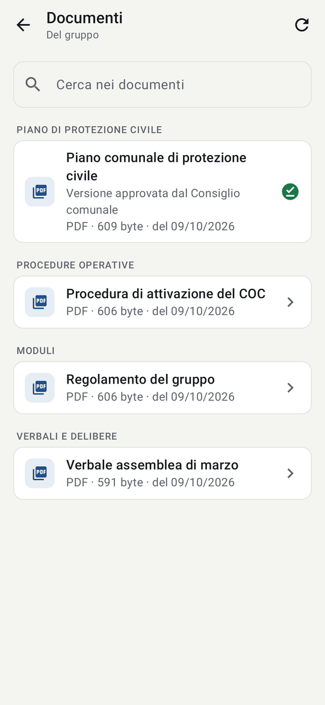

Le stesse cartelle del web. Il segno verde accanto a un documento dice che è
sul telefono e si apre anche senza rete: sono i documenti "sempre con me" e i
libretti del materiale che si ha in carico.

## 9. Il magazzino

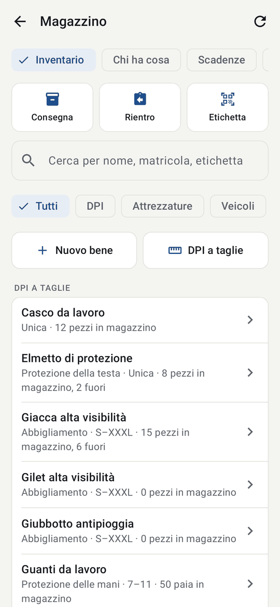

Chi gestisce il magazzino lo lavora tutto dall'app: le schede **Inventario**,
**Chi ha cosa**, **Scadenze**, il registro e le impostazioni. In cima
all'inventario ci sono **Consegna**, **Rientro** ed **Etichetta** (inquadra un
QR e apre il bene). Si cerca per nome, matricola o etichetta e si filtra per
tipo. **Nuovo bene** e **DPI a taglie** creano un bene o un DPI con le sue
taglie.

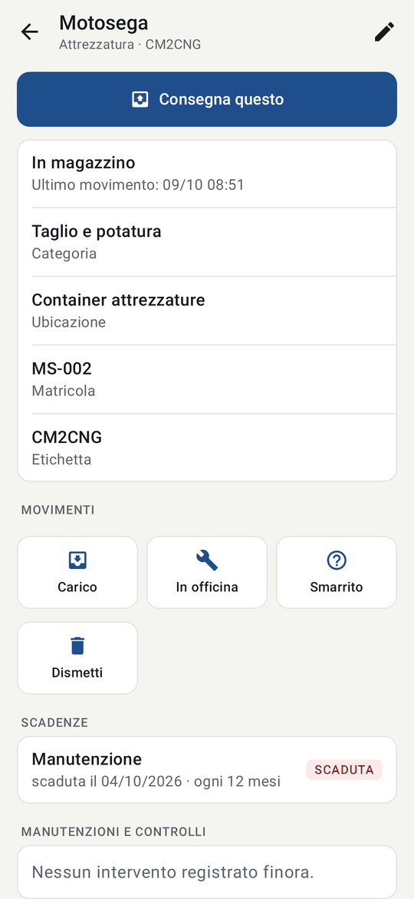

La scheda di un bene dice dove si trova, cosa scade e la sua storia. **Consegna
questo** apre la consegna con l'oggetto già scelto. Sotto ci sono i movimenti:
**Carico**, **In officina**, **Smarrito**, **Dismetti**. La matita in alto lo
modifica.

### Consegnare

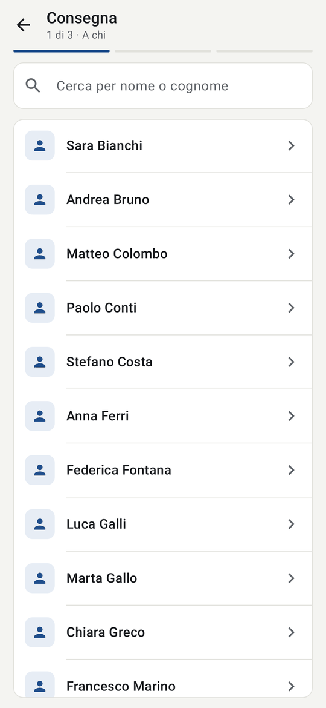

Tre passi. **A chi**: si cerca la persona.

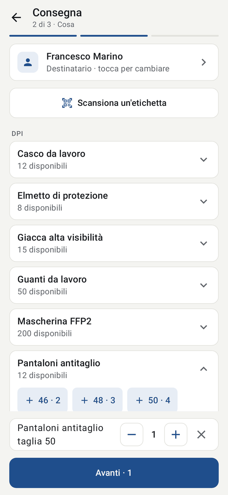

**Cosa**: si aprono i DPI e si tocca la taglia, oppure **Scansiona
un'etichetta**. La taglia della persona è segnata in verde. In fondo, **Avanti**
porta al riepilogo e alla conferma.

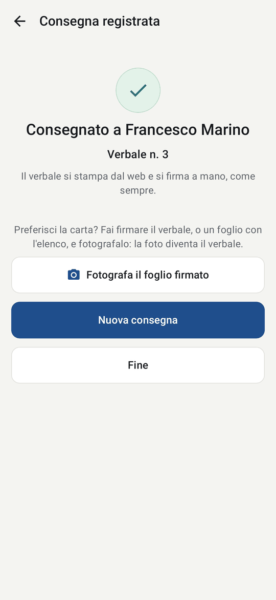

Fatta la consegna, se c'è il verbale si può fotografare il foglio firmato: la
foto diventa il verbale. La consegna funziona anche senza rete: resta in coda e
parte appena c'è campo.

### Il rientro

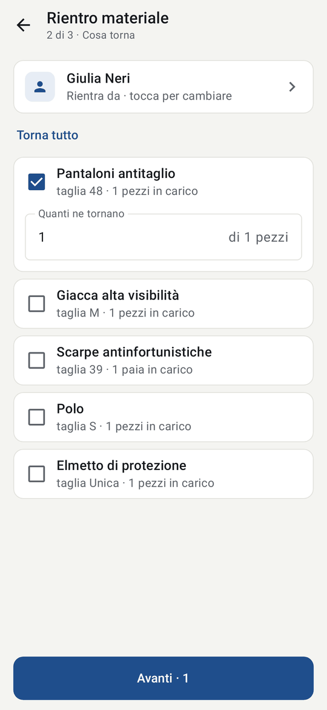

Si sceglie chi restituisce, si spunta cosa torna e quanto; se torna meno,
l'app chiede cosa ne è del resto. Il rientro vuole la rete.

### Le impostazioni del magazzino

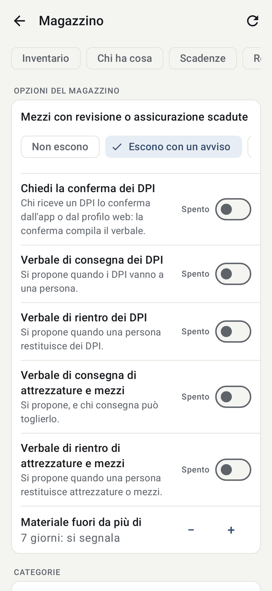

Ogni scelta si salva appena la si tocca: mezzi scaduti, conferma dei DPI,
verbali, giorni prima di segnalare il materiale fuori, categorie, ubicazioni e
i propri avvisi via email. La stampa delle etichette resta sul web.

## 10. La segreteria

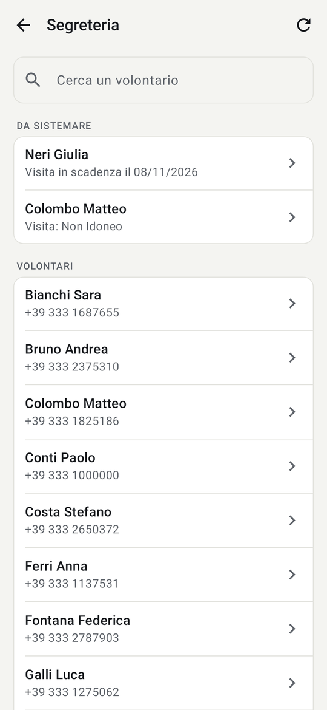

Si apre con l'impronta o il PIN. In cima chi ha qualcosa da sistemare, sotto
l'elenco dei volontari da cercare per nome. Il fascicolo mostra contatti (si
chiama con un tocco), visite, corsi e DPI.

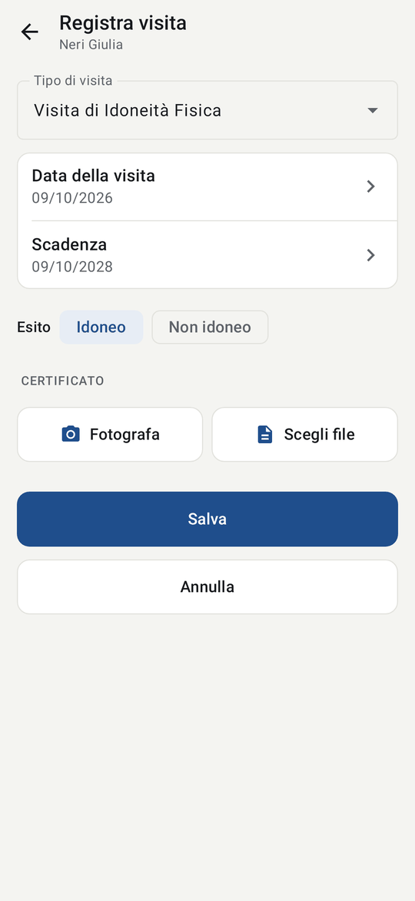

Si registra una visita o un corso: tipo, data, scadenza (proposta dal
catalogo), esito, e il certificato fotografato o scelto dai file. Anagrafica,
cataloghi e tesserini restano sul web. Senza rete la segreteria non si apre:
sono dati sanitari e sul telefono non si tengono.

## 11. Gli aggiornamenti

Quando l'associazione mette sul server una versione nuova, l'app la scarica da
sola e la installa quando non la si sta usando; con un'emergenza aperta e si è
in squadra, aspetta. La prima volta Android chiede di consentire
l'installazione da ORION e di confermare. L'app installa solo un file firmato
con la stessa chiave e più recente.

## 12. Quando qualcosa non va

| Cosa succede | Cosa fare |
|---|---|
| "Sessione scaduta" | Si rientra; se non va, la password è cambiata o l'account è sospeso |
| Il codice a sei cifre viene rifiutato | L'ora del telefono deve essere automatica |
| Le notifiche non arrivano ad app chiusa | Avvisi sul telefono: sistemare le voci segnalate e fare la prova |
| La sala non vede la squadra | Posizione "Consenti sempre" e persona in squadra |
| Una consegna non compare sul web | È in coda: parte appena c'è campo |
| L'accesso esterno è finito | L'emergenza è chiusa o l'accesso è stato revocato |
