# ORION dal browser

Questo è il manuale della web app di ORION, quella che si apre dal browser del
computer della sede o della sala operativa. Per il telefono c'è il
[manuale dell'app Android](manuale-app.md).

Le immagini vengono da un gruppo di prova, il "Gruppo Comunale di Protezione
Civile", con persone e dati inventati e la cartografia di OpenStreetMap.

Ognuno vede solo le voci che gli servono. Il menu e i pulsanti cambiano in
base al ruolo (volontario, coordinatore, segreteria, magazziniere,
amministratore) e ai moduli accesi dall'amministratore. Se una voce descritta
qui non c'è, non è un errore: non è per il tuo ruolo, o il modulo è spento.

## 1. Entrare

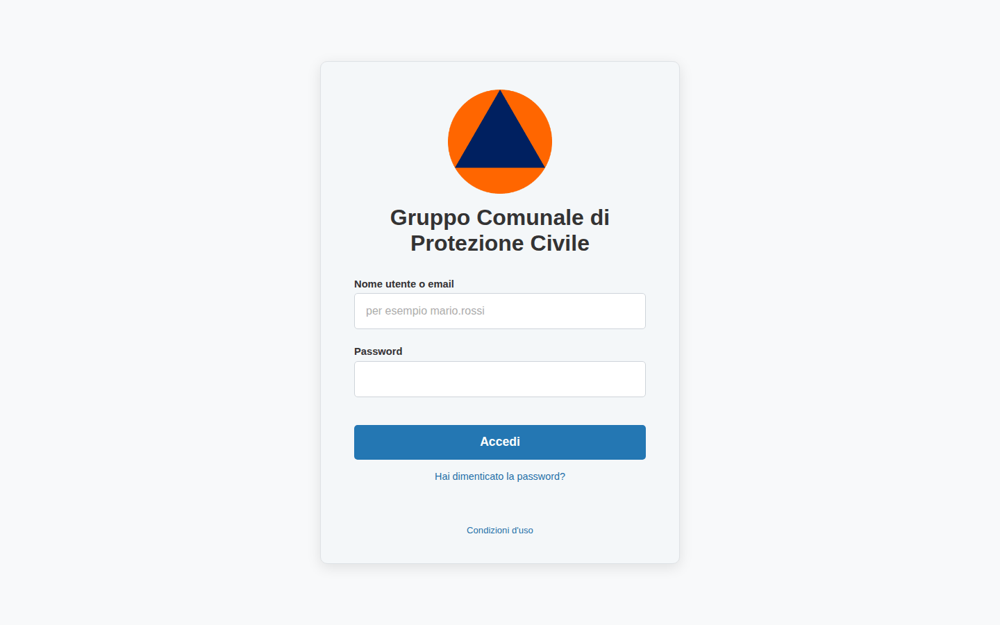

Si entra con il nome utente (o l'email) e la password. La prima password la
sceglie ciascuno dal link di attivazione che riceve quando viene iscritto: vale
sette giorni e arriva per email oppure su un foglio stampato con un QR. Dopo
troppi tentativi sbagliati dalla stessa rete l'accesso si blocca per un quarto
d'ora; gli accessi riusciti non contano, così una sala che entra tutta insieme
non si blocca.

Chi ha dimenticato la password usa "Hai dimenticato la password?" (serve la
posta configurata) oppure chiede all'amministratore un link nuovo. Il browser
ricorda il nome dell'ultima persona entrata; su un computer usato da tanti,
"Non sei tu?" lo cancella.

**Verifica in due passaggi.** Oltre alla password ORION chiede un codice di sei
cifre preso da un'app per i codici a tempo sul telefono (Google
Authenticator, Microsoft Authenticator, Aegis, FreeOTP). È obbligatoria per gli
amministratori e per chi gestisce visite mediche e corsi; per gli altri si
attiva dal profilo. All'attivazione si ricevono dieci codici di riserva, da
conservare lontano dal telefono: ognuno vale una volta, al posto del codice.

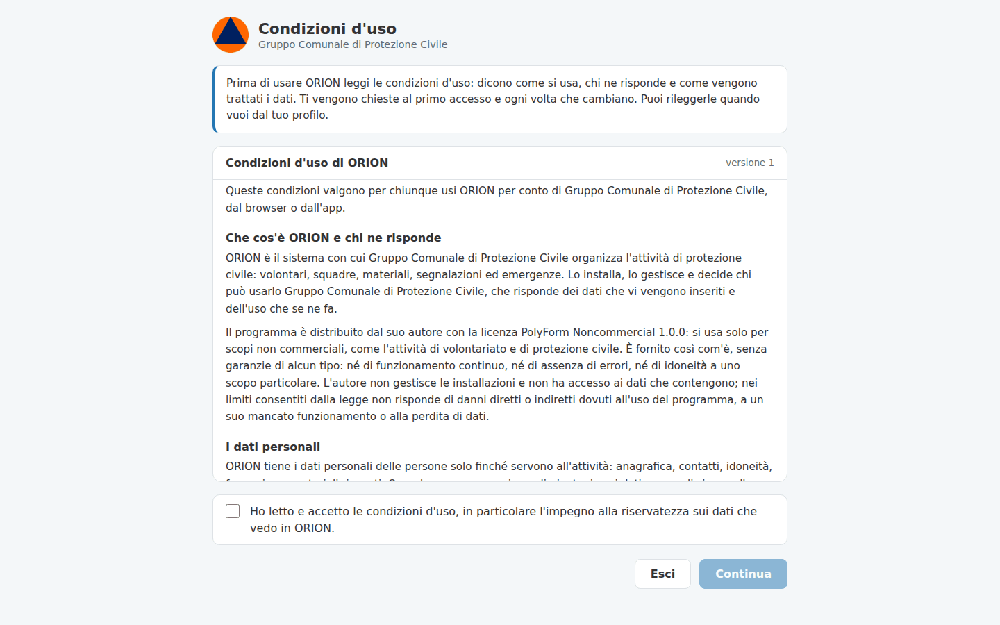

**Condizioni d'uso.** Al primo accesso, e ogni volta che l'amministratore le
cambia, ORION chiede di leggerle e accettarle. Senza, non si entra.

**Dove si arriva.** Con un'emergenza aperta si arriva tutti al centro
operativo. Senza emergenza l'amministratore va al centro operativo, la
segreteria alla Segreteria, il magazziniere al Magazzino, tutti gli altri al
proprio profilo.

## 2. Il menu

Il menu sta a sinistra in ogni pagina (sul telefono, dietro il pulsante
"Menu"). In fondo alcune pagine aggiungono voci loro: la Segreteria i
cataloghi, il profilo le sue sezioni.

| Voce | A cosa serve | Chi la vede |
|---|---|---|
| Centro Operativo | La sala operativa: mappa, segnalazioni, squadre | Tutti |
| Segreteria | Fascicoli dei volontari: visite, corsi, tesserino | Segreteria e amministratore, a modulo acceso |
| Magazzino | DPI, attrezzature e mezzi: consegne, rientri, scadenze | Interni, a modulo acceso |
| Squadre | Le squadre e i loro membri | Interni |
| Calendario | Attività, convocazioni, presenze, reperibilità | Interni, a modulo acceso |
| Simulazioni | Scenari per addestramenti ed esercitazioni | Chi organizza le attività |
| Documenti | Piano, procedure, libretti, verbali | Tutti |
| Utenti | Iscrizioni, ruoli, permessi, password | Amministratore e chi gestisce l'anagrafica |
| Archivio emergenze | Emergenze chiuse e resoconti | Chi consulta l'archivio |
| Funzioni | Le funzioni di supporto del COC | Coordinatore e amministratore, a modulo acceso |
| Impostazioni | Moduli, nome e logo, posta, tesserino, mappa | Amministratore |
| Sistema | Backup, aggiornamenti, cifratura, integrità | Amministratore |
| Il mio profilo | I propri dati, il fascicolo, la sicurezza | Tutti |
| Esci | Chiude la sessione | Tutti |

## 3. Il mio profilo

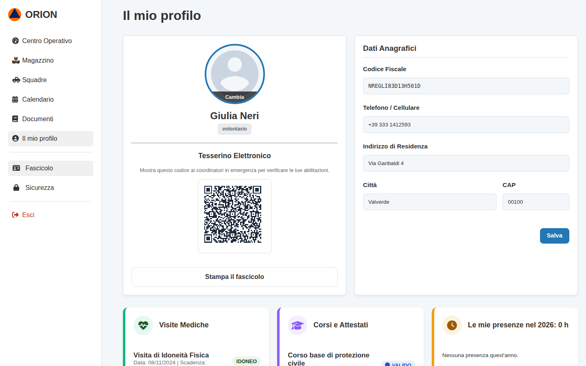

È il fascicolo personale. In alto ci sono la foto, il nome, il tesserino
elettronico con il QR e "Stampa il fascicolo", che prepara il PDF con dati,
visite e corsi. A destra si correggono codice fiscale, telefono e indirizzo.
Sotto ci sono le visite mediche, i corsi con gli attestati, le presenze
dell'anno con gli attestati da scaricare e i DPI in dotazione.

Se il magazzino chiede la conferma dei DPI, in cima compare "Materiale da
confermare": confermare vale come firma del verbale. La foto si cambia toccando
"Cambia": si inquadra il viso nell'ovale e si salva. Dalla voce **Sicurezza** del
menu si cambia la password e si attiva o si gestisce la verifica in due
passaggi.

## 4. Il centro operativo

### Senza emergenza

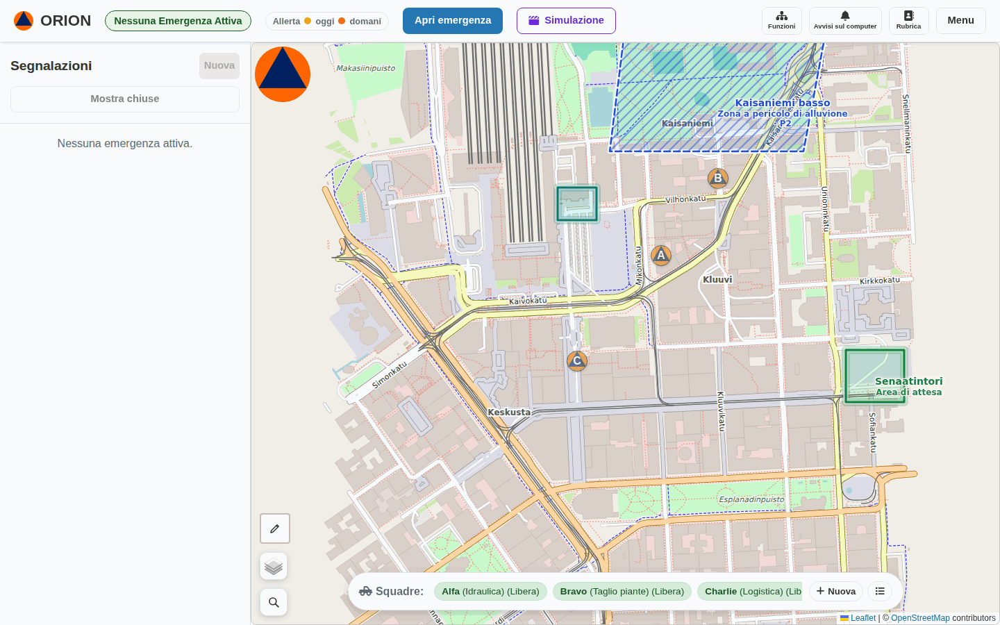

A sinistra l'elenco delle segnalazioni, al centro la mappa, in basso la barra
delle squadre. I pulsanti in alto:

| Pulsante | Cosa fa |
|---|---|
| Allerta | Il bollettino di allerta della zona del Comune, se acceso nelle impostazioni |
| Apri emergenza | Apre un'emergenza (chi ha il permesso) |
| Simulazione | Apre la sala per un addestramento al volo (capitolo 9) |
| Funzioni | Il tavolo delle funzioni di supporto |
| Avvisi sul computer | Chiede al browser di mostrare gli avvisi anche a finestra chiusa |
| Rubrica | I numeri utili dell'emergenza |
| Menu | Le altre pagine (archivio, segreteria, magazzino, calendario, documenti, squadre, profilo, uscita) |

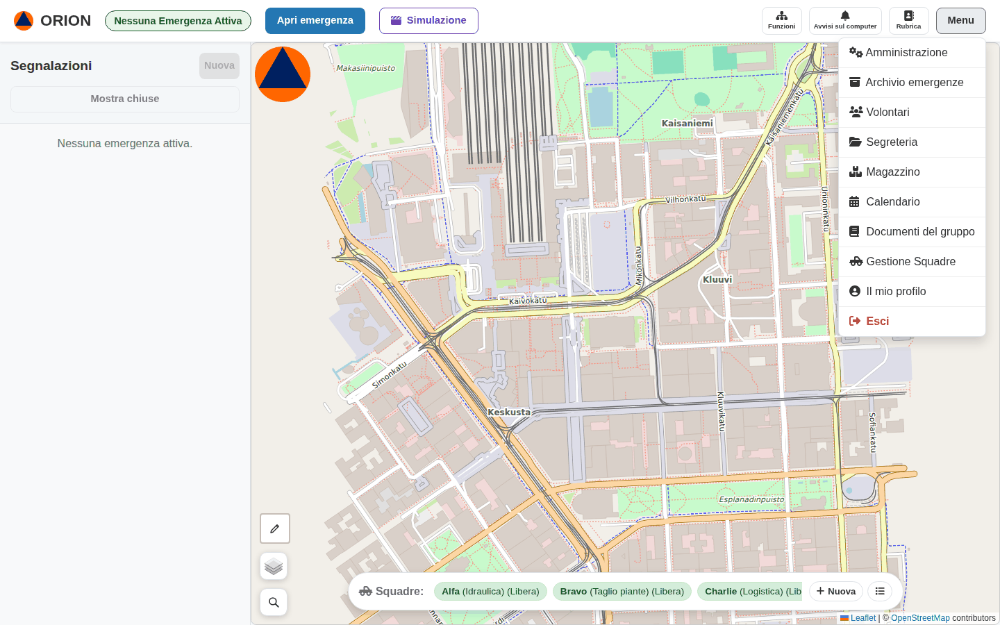

### Il bollettino di allerta

Accanto allo stato dell'emergenza c'è la pastiglia **Allerta**, con un pallino
per oggi e uno per domani: verde nessuna allerta, poi giallo, arancione, rosso.
Il grigio vuol dire che il bollettino di oggi non è ancora arrivato (esce di
norma entro le 16) o che la Regione non ha trasmesso la valutazione.

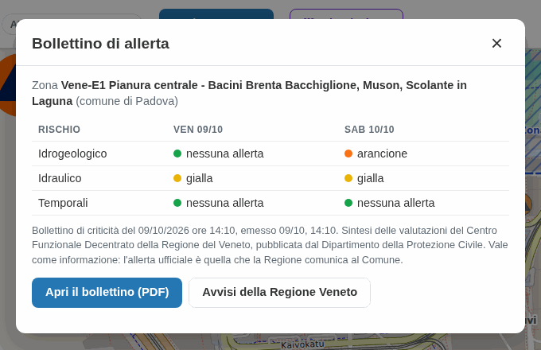

Un clic apre la finestra: la zona d'allerta, il livello di ciascun rischio
(idrogeologico, idraulico, temporali) per i due giorni, il PDF del bollettino e
il collegamento agli avvisi della Regione. Se nella giornata esce un
aggiornamento, ORION lo legge da solo e la finestra elenca tutte le versioni.

Il bollettino è quello nazionale del Dipartimento della Protezione Civile, che
riporta le valutazioni del Centro Funzionale della Regione. Vale come
informazione: l'allerta ufficiale resta quella che la Regione manda al Comune
per i canali previsti dal piano.

Con un'emergenza aperta ogni versione del bollettino, compresa quella in
vigore al momento dell'apertura, entra da sola nei **documenti
dell'emergenza** (il PDF, caricato da "ORION") e nel **diario di sala** (i
livelli della zona). Così finisce nel resoconto e nello storico sigillato. Le
simulazioni non lo ricevono.

### Aprire un'emergenza

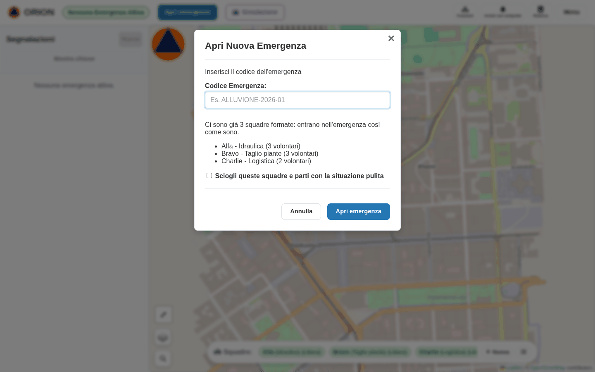

Si scrive il codice dell'emergenza. Le squadre già formate entrano così come
sono; la casella "Sciogli queste squadre" le chiude e si parte da zero. Chi è in
una squadra riceve l'avviso sull'app. All'apertura ORION crea anche la squadra
**COC**, cioè chi lavora in sala: si compone come le altre, non va sugli
interventi e vede tutte le segnalazioni.

### La sala durante l'emergenza

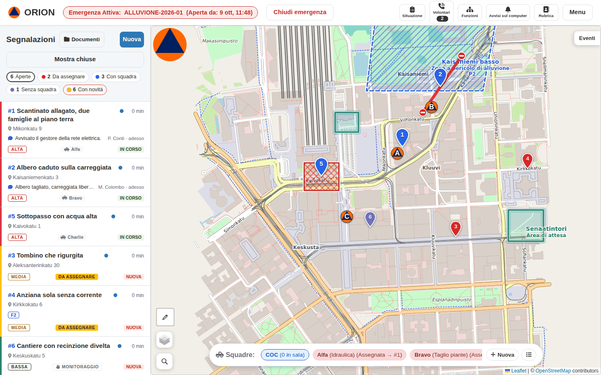

In alto c'è la fascia rossa con il codice dell'emergenza, accanto "Chiudi
emergenza". I pulsanti diventano Situazione, Volontari, Funzioni, Avvisi sul
computer, Rubrica e Menu.

**L'elenco delle segnalazioni.** Ogni scheda mostra numero, titolo, indirizzo,
l'ultima nota scritta da una persona, la priorità, la squadra e lo stato. In
cima c'è il riepilogo: Aperte, Da assegnare, Con squadra, Senza squadra, Con
novità. Un clic su una voce filtra l'elenco, un altro lo riporta completo.
"Documenti" apre i documenti caricati per questa emergenza.

**I colori.** Il segnaposto è rosso se aspetta una squadra, blu se ne ha una,
viola se non ne ha bisogno (gestita da altro ente, solo monitoraggio, nessun
intervento), verde se risolta, grigio se chiusa. Quelle ad alta priorità hanno
il segnaposto più grande. Una segnalazione senza squadra da più di 15 minuti
(il tempo si cambia nelle Impostazioni) diventa rossa con la scritta DA
ASSEGNARE.

**Le novità.** Una nota dal campo, delle foto o una segnalazione nuova fanno
lampeggiare la scheda e saltare il segnaposto, e compare un avviso in alto a
destra. Le modifiche dei colleghi in sala aggiungono solo un numero alla scheda.
Il server ricorda cosa ha letto ciascuno, anche cambiando computer.

**Eventi.** La linguetta "Eventi" a destra apre il diario di sala: si scrive
quello che non riguarda una segnalazione (la telefonata con il Sindaco, una
decisione presa) e si preme Annota o Ctrl+Invio. Il diario finisce nel resoconto.

### Le segnalazioni

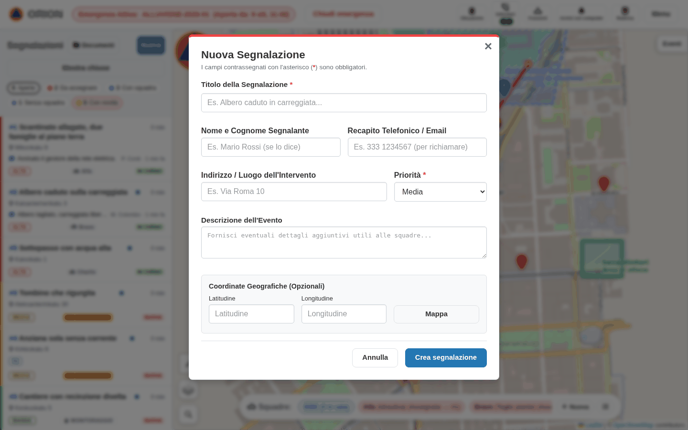

"Nuova" apre il modulo. Serve solo il titolo, cioè cosa succede: nome e numero
di chi chiama, indirizzo, priorità e descrizione si aggiungono quando ci sono.
Il punto si mette con "Mappa" e un clic, oppure scrivendo le coordinate.

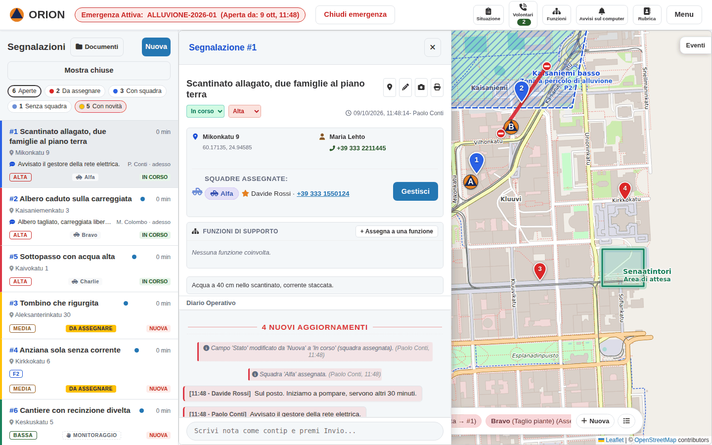

Cliccando una segnalazione si apre la sua scheda. In alto si cambiano stato e
priorità; le icone servono a modificare, spostare il punto, caricare foto e
stampare. Poi vengono le squadre assegnate (con il caposquadra e il suo
telefono), le funzioni di supporto e il diario. "Gestisci" assegna o toglie le
squadre, oppure dice perché la segnalazione non ha bisogno di una squadra. Il
diario tiene in ordine tutto quello che succede: le note delle persone e,
più chiari, gli eventi registrati da ORION. Si scrive in fondo e si preme Invio.

Assegnare la prima squadra porta la segnalazione a "In corso"; togliere
l'ultima la riporta ad "Aperta". Se il punto cade in una zona di pericolo
disegnata sulla mappa, ORION lo aggiunge ai rischi da solo.

### Le squadre in sala

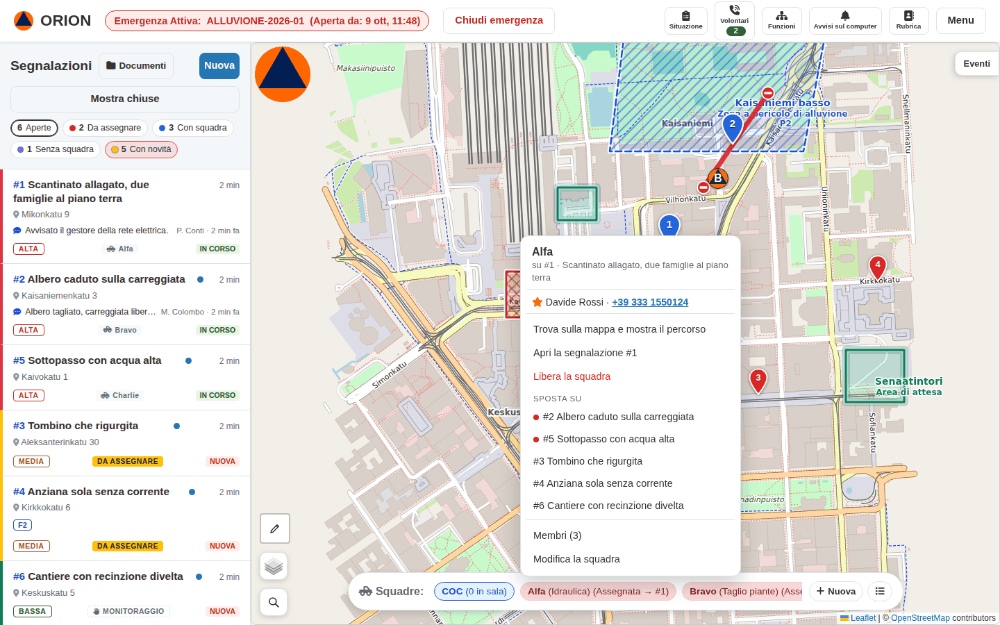

Nella barra in basso ogni squadra dice dov'è impegnata. Un clic apre il suo
menu: il caposquadra con il telefono, "Trova sulla mappa e mostra il percorso",
la segnalazione su cui lavora, "Libera la squadra", lo spostamento su un'altra
segnalazione, i membri e la modifica. Nella finestra dei membri la stella
nomina il caposquadra. "Nuova" crea una squadra. Sulla mappa ogni squadra con
l'app accesa compare con la sua lettera.

### La mappa

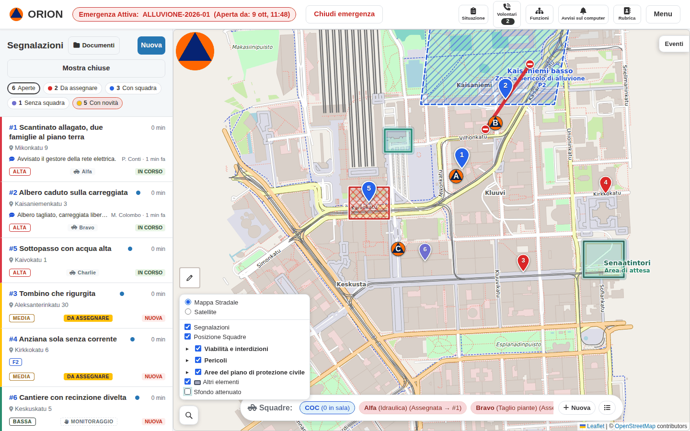

In basso a sinistra ci sono tre pulsanti. La **matita** disegna strade chiuse,
zone interdette, zone di pericolo e aree del piano. I **livelli** scelgono lo
sfondo (stradale o satellite) e cosa mostrare. La **lente** cerca
segnalazioni, squadre, indirizzi e coordinate.

Le strade chiuse sono linee rosse con il segnale di divieto, le zone interdette
sono rosse a quadretti, le zone di pericolo blu (alluvione), marroni (frana) o
arancioni. Le aree di attesa, accoglienza e ammassamento sono verdi e viola.
Cliccando un elemento si leggono i suoi dati e lo si modifica o toglie.

### Chiamare i volontari

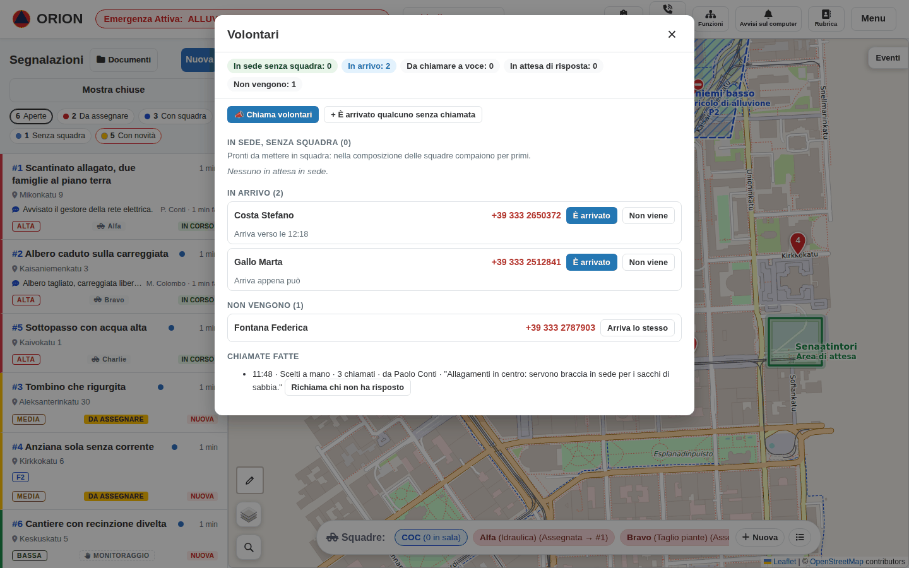

"Volontari" apre il pannello della chiamata. Con "Chiama volontari" si sceglie
chi chiamare (tutti, i reperibili di oggi, chi ha un certo corso, oppure
persone scelte a mano), si scrive un messaggio breve e si decide come avvisare
(app, email o tutti e due). Le persone rispondono dal telefono: "Arrivo
subito", "Fra 30 minuti", "Non posso". Il pannello le divide in da chiamare a
voce, in attesa, in arrivo, in sede e non vengono. Chi arriva lo segna "È
arrivato"; chi si presenta senza chiamata si aggiunge con "È arrivato qualcuno
senza chiamata". Chiama chi apre le emergenze o organizza le attività.

### Le funzioni di supporto

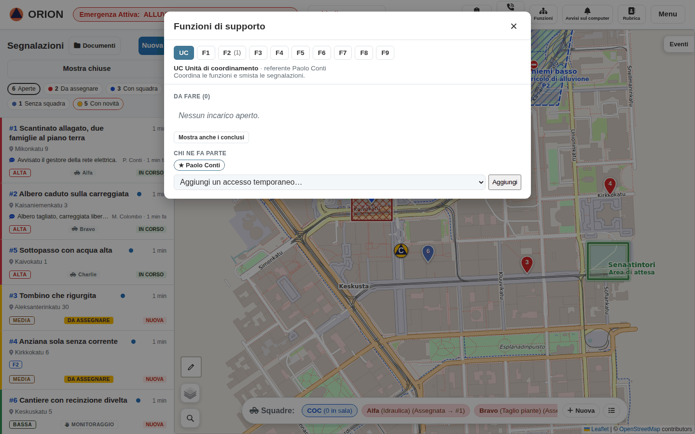

Se il modulo è acceso, la sala lavora per funzioni (metodo Augustus). Dalla
scheda di una segnalazione, "Assegna a una funzione" dà un incarico con il
motivo. Il pannello "Funzioni" mostra per ogni sigla gli incarichi da fare e
chi ne fa parte: si prendono in carico, si annotano e si concludono con
l'esito. Concludere un incarico non chiude la segnalazione.

### Rubrica, situazione e accessi esterni

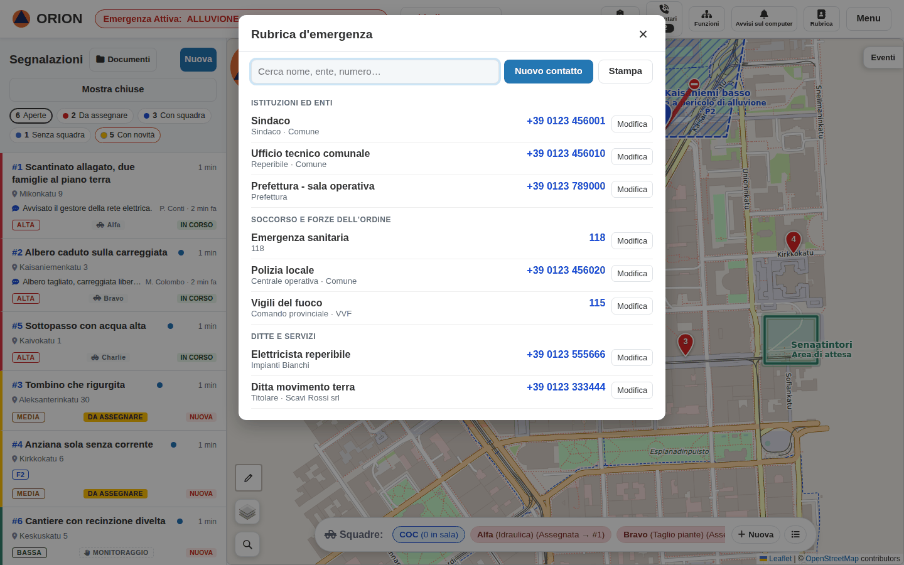

La **Rubrica** raccoglie i numeri utili, divisi per gruppi. Si cerca, si
aggiunge con "Nuovo contatto", si stampa per averla anche senza rete.

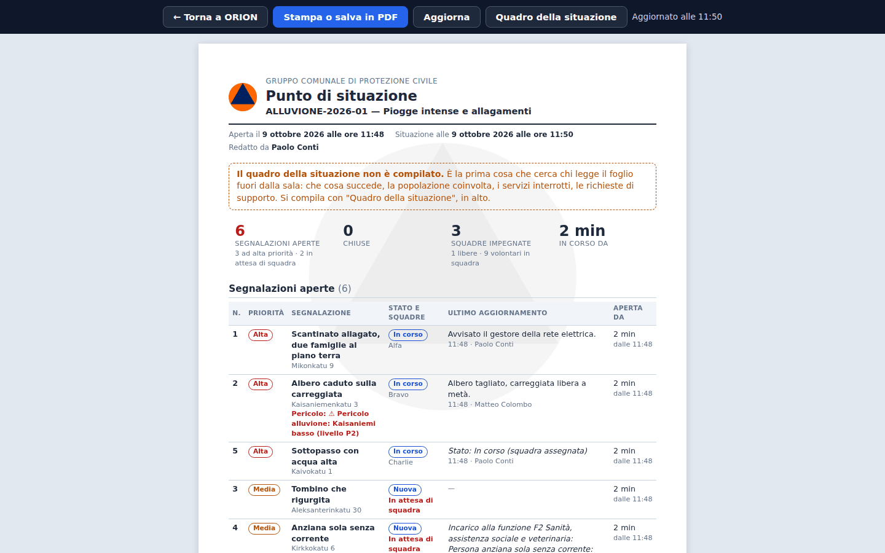

**Situazione** apre il punto di situazione da stampare o salvare in PDF:
numeri, segnalazioni aperte, squadre, funzioni, strade chiuse, ultime note del
diario. "Quadro della situazione" aggiunge in cima quello che chiede chi legge
da fuori: cosa succede, popolazione coinvolta, servizi interrotti, richieste
agli enti, recapiti del COC.

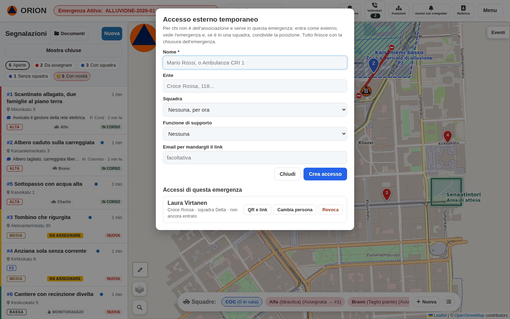

**Accesso esterno** (dal Menu) fa entrare chi non è del gruppo (Croce Rossa,
tecnico comunale) senza account: si scrive il nome, eventualmente ente,
squadra e funzione, e ORION mostra un QR da inquadrare. L'esterno vede solo
l'emergenza e gli interventi della sua squadra. L'accesso finisce da solo alla
chiusura; nell'elenco sotto si rimostra il QR, si cambia persona o si revoca.

### Se cade la rete

Se il server non risponde compare una fascia rossa: non si ricarica la pagina.
Si continua a lavorare, le operazioni restano in coda e partono da sole quando
il server torna. Se mancano solo le mappe da internet e l'associazione ha
caricato la cartografia del territorio, la mappa passa da sola al fondo
"Territorio (dal server)".

### Chiudere l'emergenza

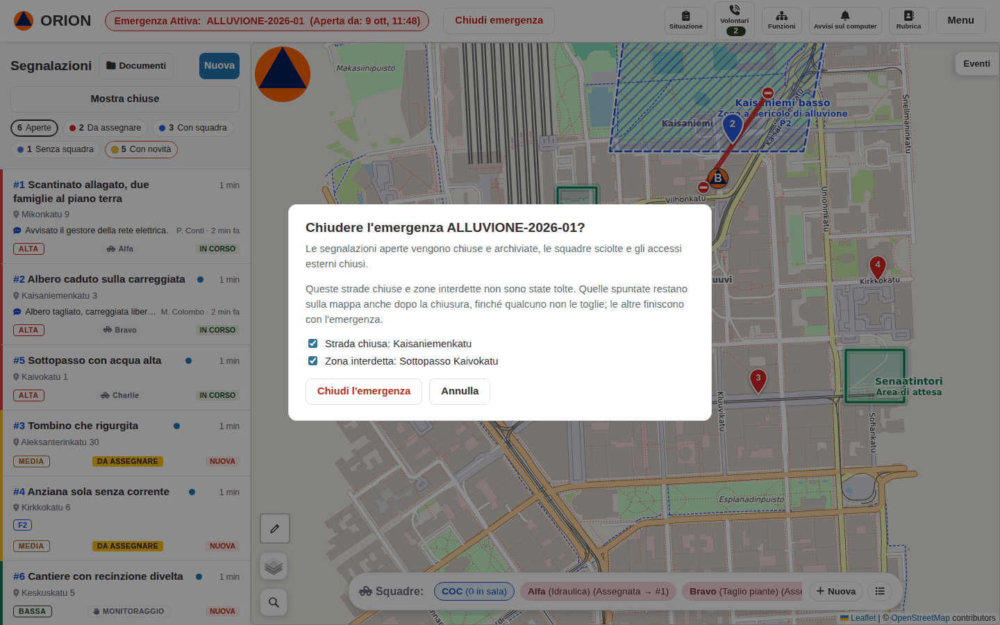

"Chiudi emergenza" chiede conferma ed elenca strade chiuse e zone interdette:
quelle spuntate restano sulla mappa anche dopo. Alla chiusura ORION salva un
backup, scrive il resoconto, chiude le squadre rimaste vuote, termina gli
accessi esterni e mostra il sigillo dello storico, da copiare e conservare.

## 5. La segreteria

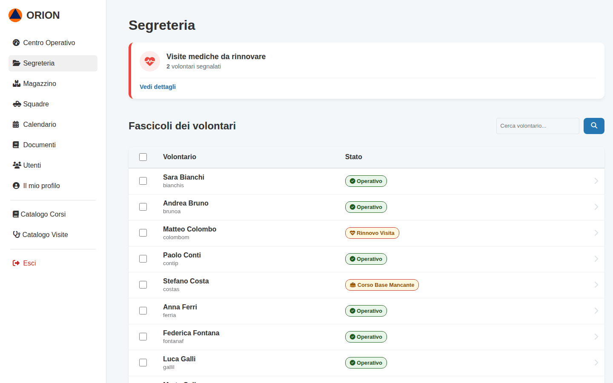

In cima ci sono le scadenze da sistemare, sotto i fascicoli dei volontari con
il loro stato: Operativo (visita e corso base validi), Rinnovo visita, Corso
base mancante, Non operativo, Dati da inserire. Si cerca per nome.

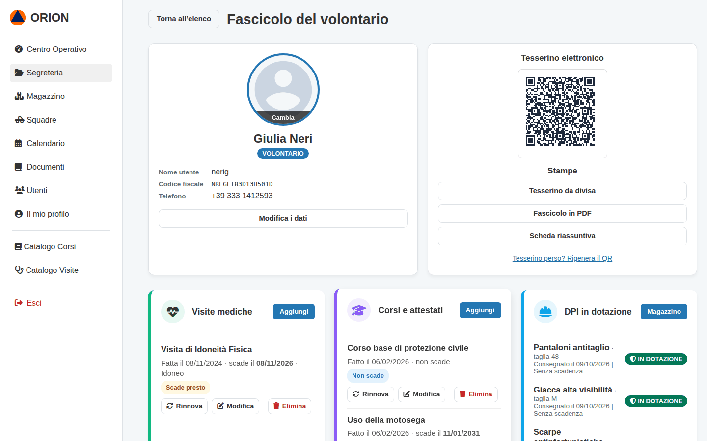

Cliccando una persona si apre il suo fascicolo: dati e "Modifica i dati",
tesserino con il QR e le stampe (tesserino da divisa, fascicolo in PDF, scheda
riassuntiva), poi visite, corsi, DPI e presenze. Ogni visita e corso ha
Rinnova, Modifica ed Elimina. "Tesserino perso? Rigenera il QR" rende inutile
quello vecchio.

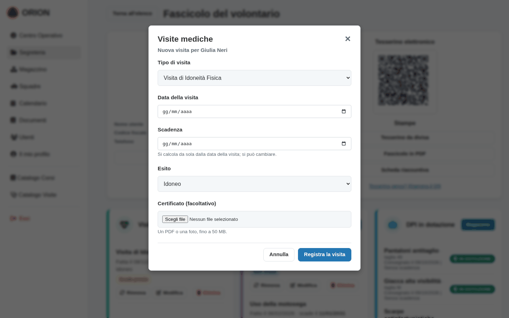

"Aggiungi" registra una visita o un corso: tipo, data, esito, certificato. La
scadenza si calcola da sola dal catalogo e si può cambiare.

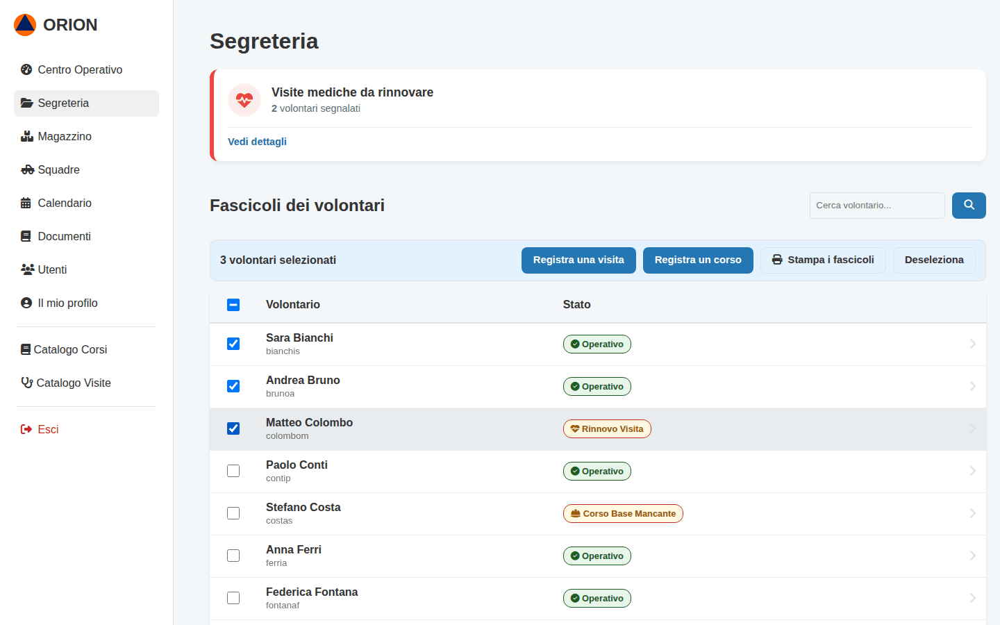

Per la visita collettiva o il corso fatto insieme si spuntano le persone
nell'elenco e si usa "Registra una visita" o "Registra un corso". Con le
stesse spunte "Stampa i fascicoli" prepara un PDF unico. Le voci **Catalogo
Corsi** e **Catalogo Visite** del menu tengono i tipi con la loro validità.

## 6. Il magazzino

Il magazzino tiene DPI, attrezzature e mezzi. Le giacenze non si scrivono a
mano: le calcola ORION dai movimenti. Consegna e Rientro sono di chi ha il
permesso di consegnare (il magazziniere); Inventario, Verbali e registro e
Impostazioni di chi gestisce il magazzino. Gli altri interni vedono Chi ha cosa
e Scade e manca.

### Consegna

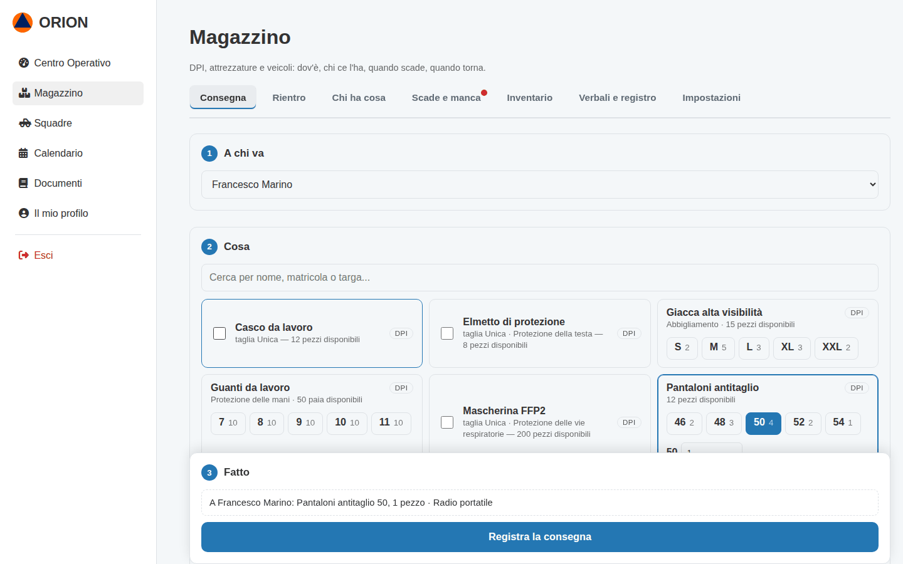

Tre passi. **A chi va**: si sceglie la persona (sotto compaiono le taglie che
ha già ricevuto). **Cosa**: si spuntano gli oggetti; per un DPI si tocca la
taglia e si dice quanti. La taglia della persona è segnata in verde ("Sua
taglia"), oppure in verde tratteggiato quella dedotta da un DPI simile.
**Fatto**: il riepilogo e "Registra la consegna". Il riquadro finale resta in
fondo allo schermo mentre si scorre. Se l'associazione usa il verbale, compare
la casella per prepararlo.

### Rientro

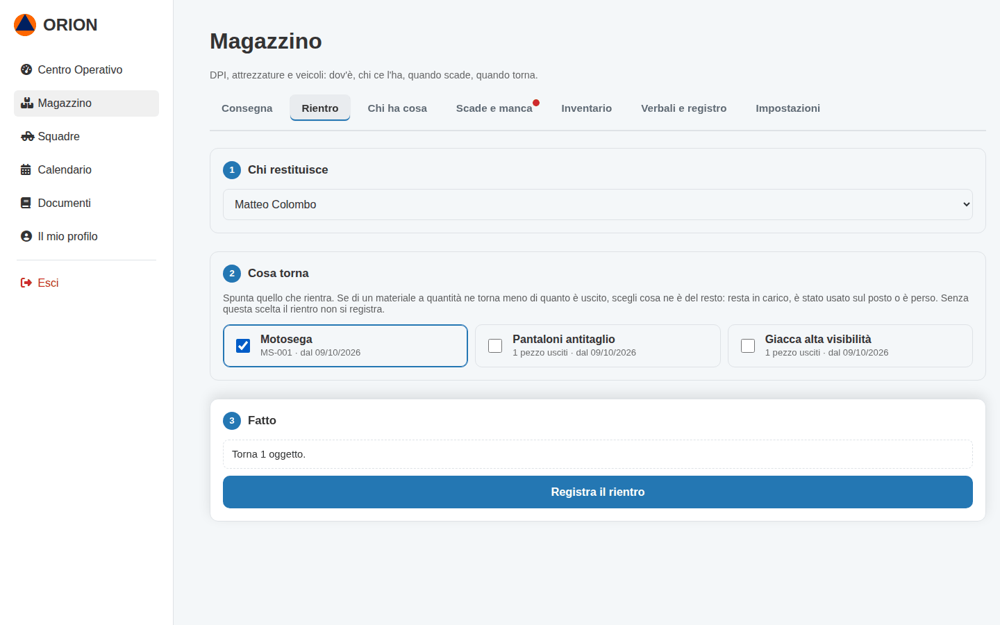

Si sceglie chi restituisce, si spunta cosa torna e quanto. Se di un materiale
a quantità ne torna meno, ORION chiede cosa ne è del resto: resta in carico, è
stato usato o è perso. Per i mezzi si possono scrivere i chilometri.

### Chi ha cosa, Scade e manca

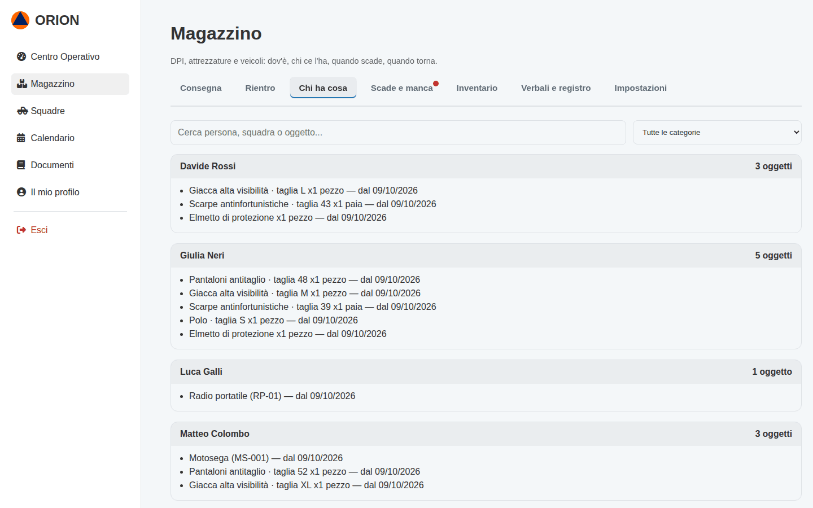

**Chi ha cosa** elenca per persona il materiale in carico, con la taglia e la
data. Si cerca per persona o oggetto.

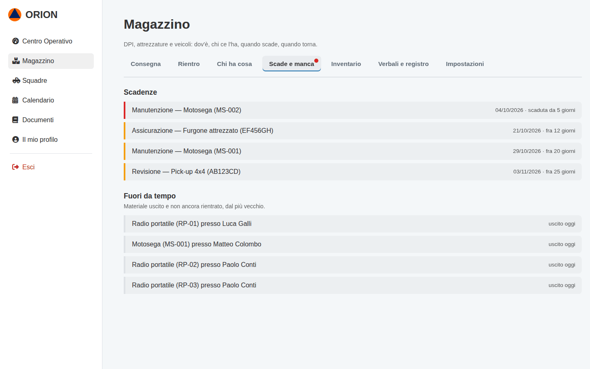

**Scade e manca** mostra revisioni, assicurazioni, manutenzioni e scadenze dei
DPI, in rosso quelle passate, e il materiale fuori da troppo tempo. Il pallino
rosso sulla scheda dice che c'è qualcosa da guardare.

### Inventario e scheda di un bene

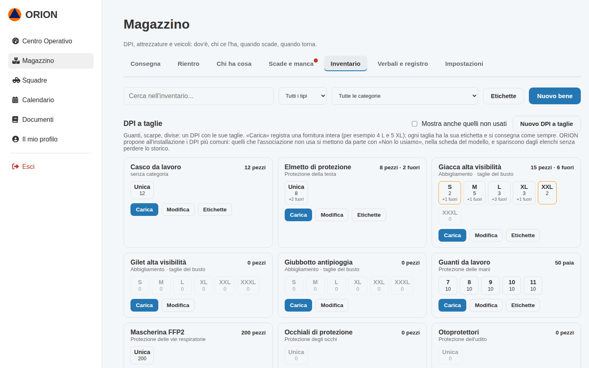

L'**Inventario** ha in alto i DPI a taglie, uno per modello, con le quantità per
taglia e i pulsanti Carica (arriva una fornitura), Modifica ed Etichette. Sotto
ci sono attrezzature e mezzi. "Nuovo bene" e "Nuovo DPI a taglie" li creano. I
DPI proposti da ORION che il gruppo non usa si nascondono con "Non lo usiamo".

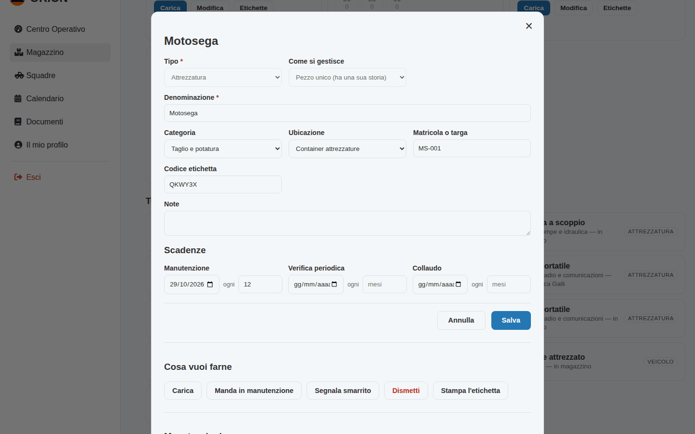

La **scheda** si apre cliccando un bene: dati, categoria, ubicazione,
matricola, codice dell'etichetta e scadenze, con ogni quanti mesi si
rinnovano. Sotto "Cosa vuoi farne" ci sono Consegna questo, Carica, Manda in
manutenzione, Segnala smarrito, Dismetti e Stampa l'etichetta. Più in basso le
manutenzioni, i libretti collegati e la storia. Un bene non si cancella mai: si
dismette.

### Etichette QR

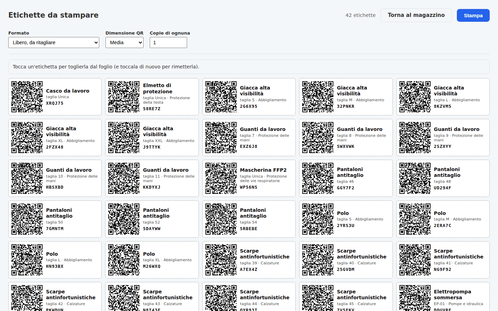

"Etichette" stampa i QR dei beni, su foglio libero o su fogli adesivi A4, con
le copie, le posizioni da saltare e la correzione in millimetri. Il QR
inquadrato con il telefono apre la scheda del bene; se non si è entrati, prima
chiede l'accesso e poi torna al bene. Su Android la pagina propone "Apri
nell'app". Dalla scheda, "Consegna questo" apre la consegna con l'oggetto già
scelto.

### Verbali, registro e impostazioni

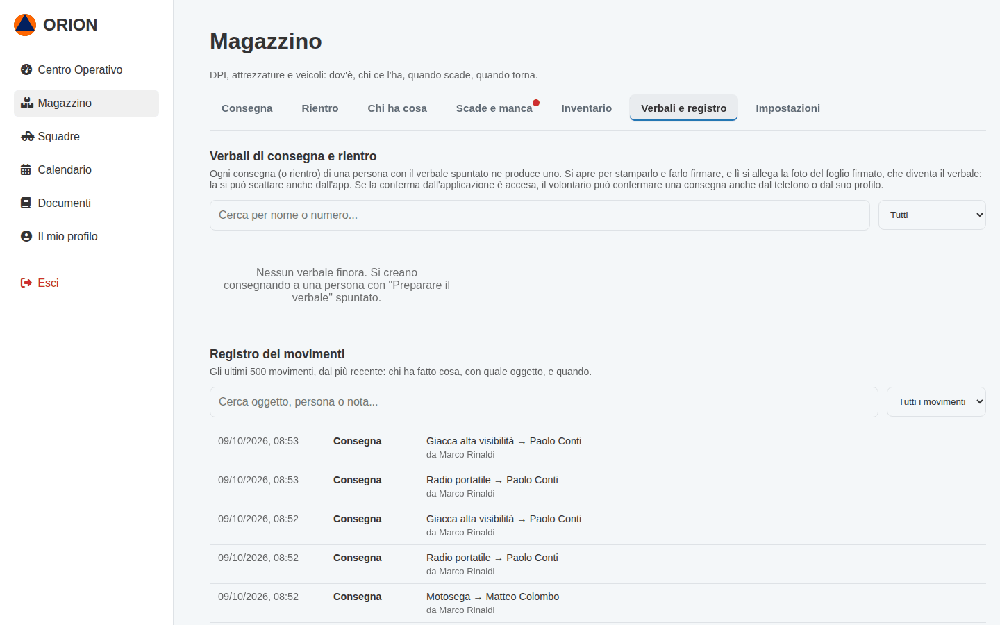

**Verbali e registro** raccoglie i verbali di consegna e rientro (da stampare,
o con la foto del foglio firmato) e tutti i movimenti, con chi li ha fatti.

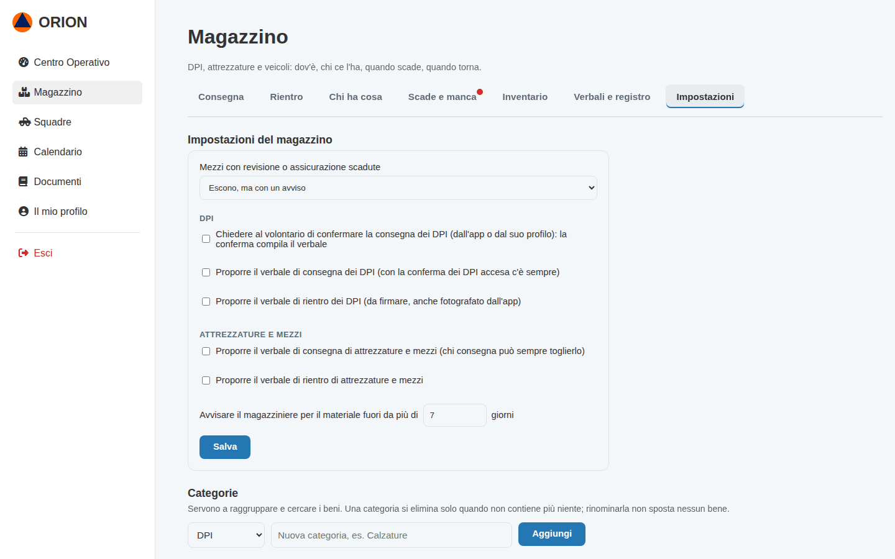

Nelle **Impostazioni** si decide se i mezzi scaduti possono uscire, se chiedere
la conferma dei DPI dall'app o dal profilo, quali verbali proporre (separati
per DPI e per attrezzature e mezzi) e dopo quanti giorni segnalare il materiale
fuori. Sotto si gestiscono categorie, ubicazioni e i propri avvisi via email.

## 7. Le squadre

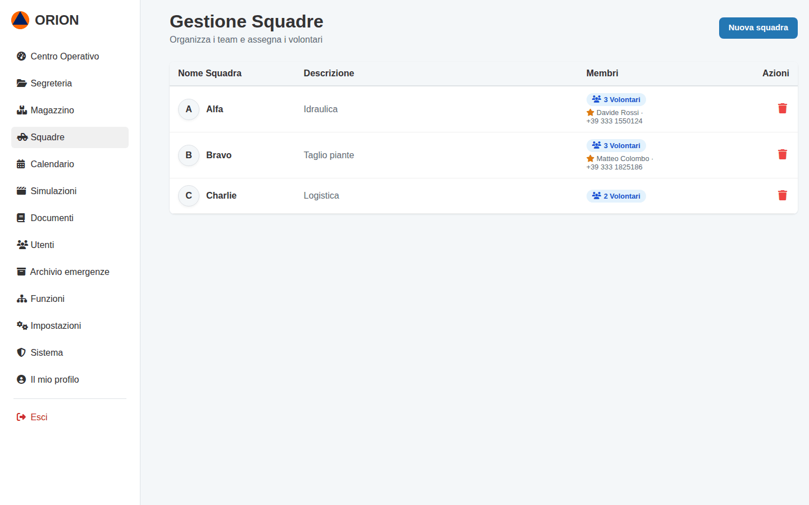

L'elenco delle squadre con nome radio (Alfa, Bravo, Charlie...), descrizione,
membri e caposquadra con il telefono. Cliccando una squadra se ne vedono i
membri; il cestino la scioglie se non è impegnata.

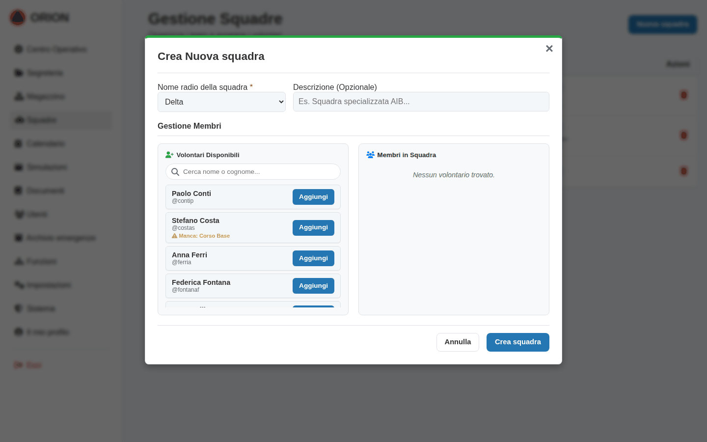

"Nuova squadra": si sceglie il nome radio, si scrive la descrizione e si
aggiungono i volontari dall'elenco di sinistra. La stella accanto a un membro
lo nomina caposquadra. Una persona sta in una squadra sola. Le squadre le
compone qualunque interno; ogni cambio resta nel registro.

## 8. Il calendario

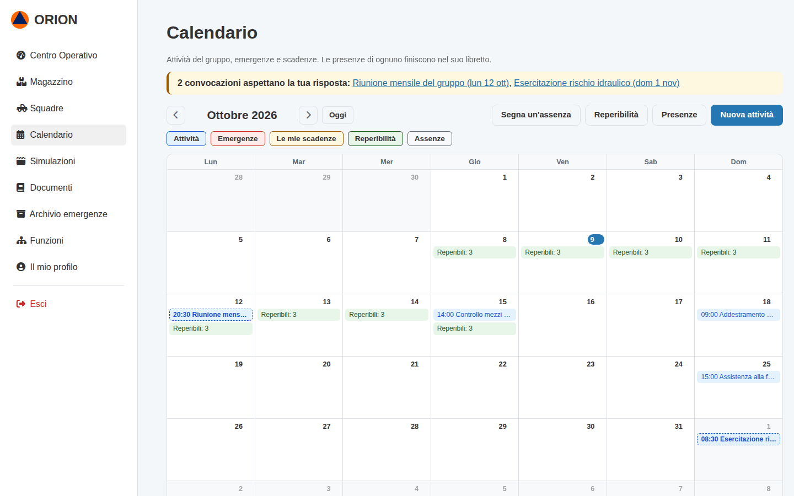

La griglia del mese con attività, emergenze, scadenze e reperibilità; i filtri
sopra accendono e spengono le categorie. In cima una fascia ricorda le
convocazioni a cui rispondere. I pulsanti:

| Pulsante | Cosa fa |
|---|---|
| Segna un'assenza | I giorni in cui non ci sei: le chiamate generali non ti arrivano |
| Reperibilità | Mette le persone di turno (chi organizza) |
| Presenze | Il riepilogo dell'anno, scaricabile (chi organizza o gestisce l'anagrafica) |
| Nuova attività | Crea un'attività (chi organizza) |

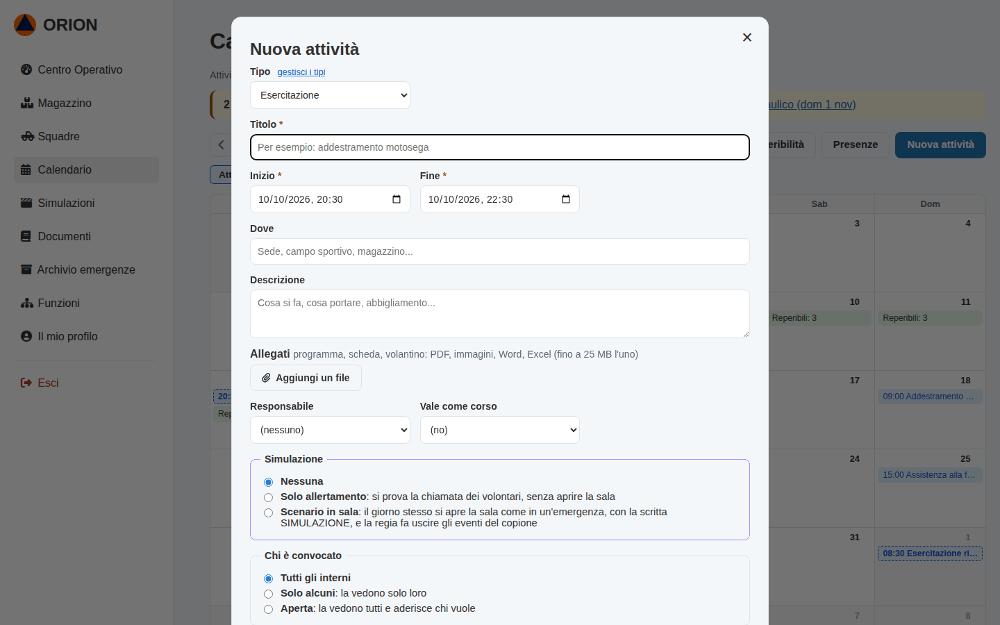

**Nuova attività** (o clic su un giorno): tipo, titolo, inizio e fine, luogo,
descrizione, allegati, responsabile. Un addestramento può valere come corso
del catalogo. La **convocazione** può essere per tutti gli interni, per alcuni
scelti, oppure aperta (aderisce chi vuole, fino ai posti). Si sceglie se
avvisare con l'app, con l'email o in nessuno dei due modi. Per addestramenti ed
esercitazioni c'è la **simulazione**: solo allertamento (si prova la chiamata)
o scenario in sala.

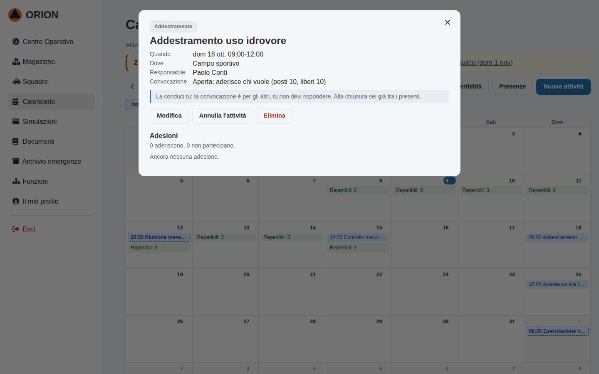

Cliccando un'attività si legge la scheda e si risponde **Partecipo** o **Non
partecipo**. Chi organizza vede le risposte, modifica, annulla, elimina e, a
fine attività, **chiude con i presenti**: le ore finiscono nel libretto di
ognuno, con l'attestato in PDF.

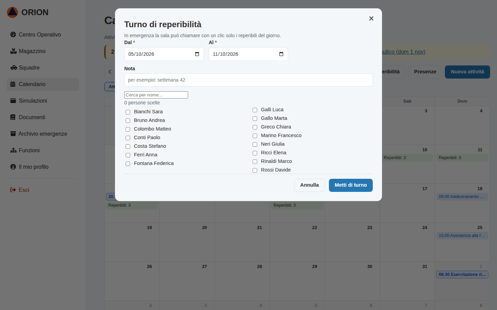

Il **turno di reperibilità** si fa scegliendo le persone e i giorni. In
emergenza la sala chiama con un clic i reperibili del giorno.

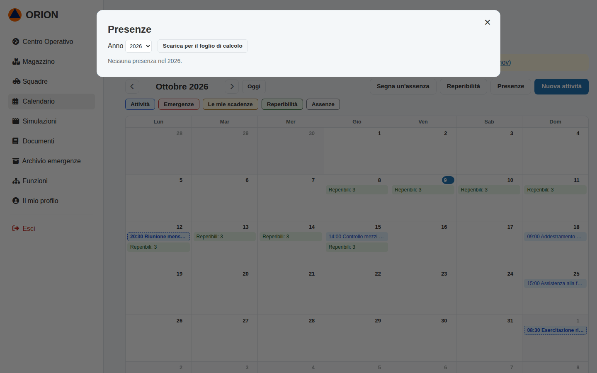

**Presenze** mostra per l'anno quante emergenze, attività e ore ha ciascuno, e
scarica il foglio di calcolo. Le presenze in emergenza le calcola ORION da sé,
dal tempo passato in squadra.

## 9. Le simulazioni

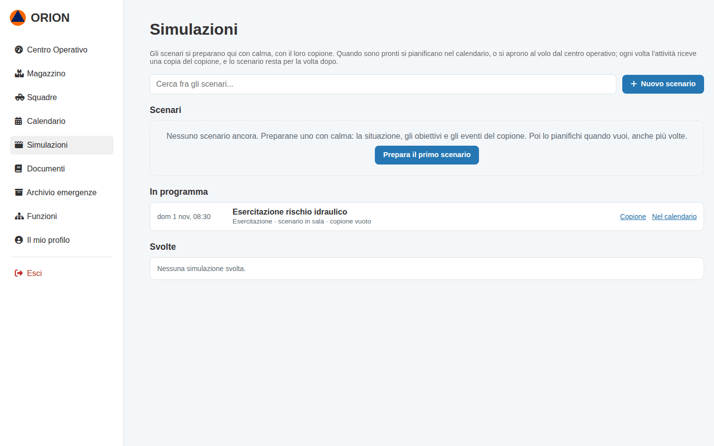

È l'archivio degli scenari per addestramenti ed esercitazioni, preparati con
calma e usati quando servono. Sotto ci sono le simulazioni in programma e
quelle svolte.

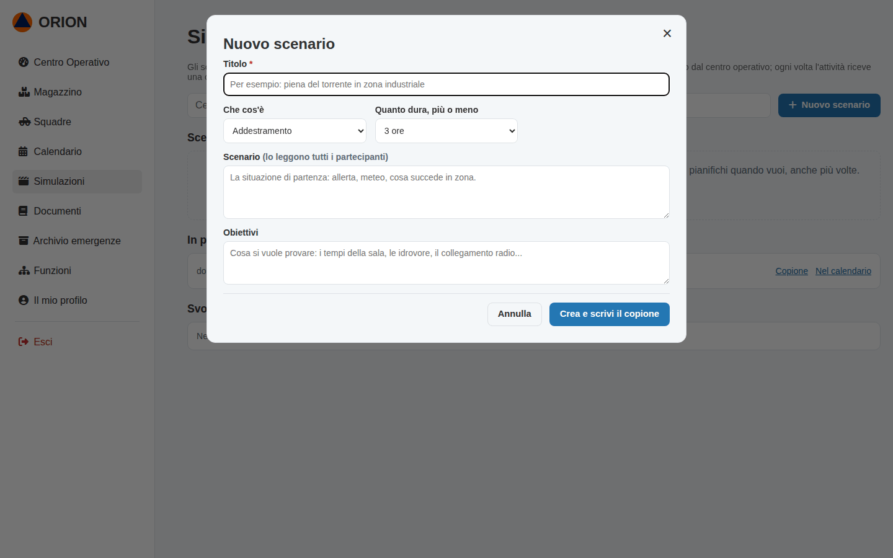

**Nuovo scenario**: titolo, tipo, durata, la situazione di partenza per i
partecipanti e gli obiettivi. Poi si scrive il copione. "Pianifica" lo mette
nel calendario come attività.

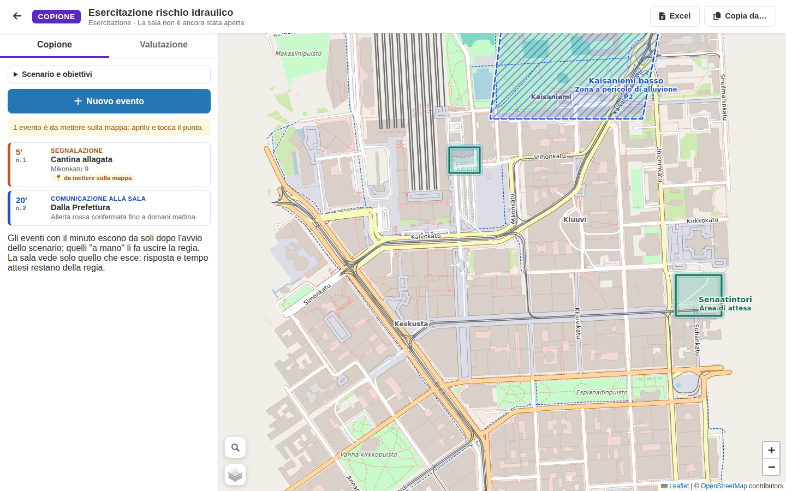

Il **copione** è l'elenco degli eventi, su una mappa come quella della sala.
"Nuovo evento" chiede cosa succede (segnalazione, aggravamento, comunicazione
alla sala, imprevisto per una squadra, strada chiusa, zona) e quando esce: a un
certo minuto o a mano. Il copione si può scrivere anche in Excel ("Excel",
scarica il modello e ricarica il foglio) o copiare da un altro ("Copia da").

**Il giorno della simulazione** la sala si apre dalla scheda dell'attività con
"Apri la sala" (oppure al volo con "Simulazione" dal centro operativo). Tutto
funziona come in un'emergenza, ma con la fascia viola SIMULAZIONE ovunque. La
regia, dal pulsante "Regia", avvia lo scenario, fa uscire gli eventi e prende
nota. A sala chiusa, la scheda **Valutazione** del copione mostra i tempi della
sala e raccoglie il debriefing. Se arriva un'emergenza vera, "Emergenza reale"
ferma la simulazione e la apre subito.

## 10. I documenti

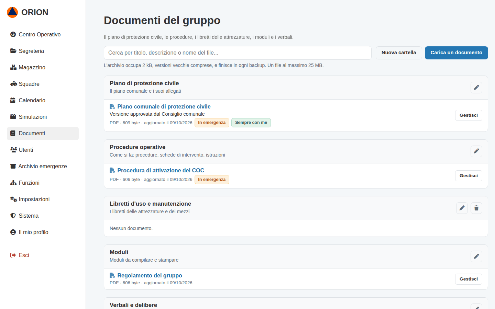

Il piano di protezione civile, le procedure, i libretti dei mezzi, i moduli e i
verbali, divisi in cartelle. Si cerca per titolo o contenuto; il titolo apre il
documento. Due segni dicono come si comporta: **In emergenza** (lo vedono anche
gli esterni durante l'emergenza) e **Sempre con me** (l'app lo tiene sul
telefono, leggibile senza rete).

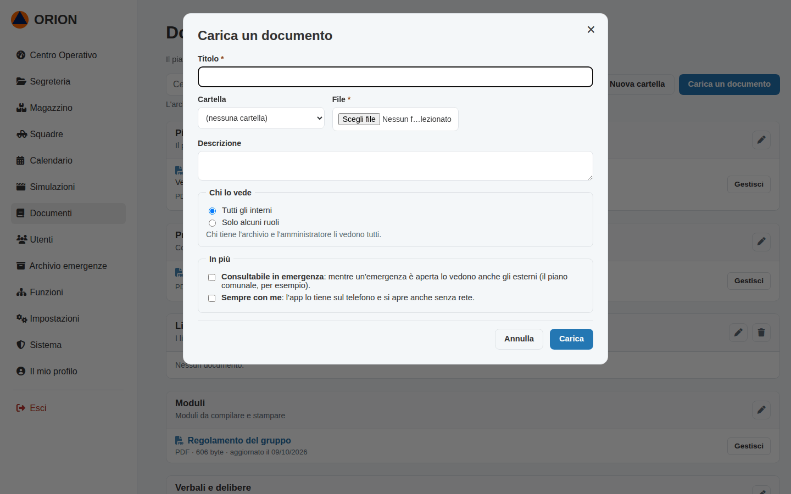

Chi tiene l'archivio usa "Carica un documento": titolo, cartella, file (fino a
25 MB), chi lo vede (tutti gli interni o solo alcuni ruoli) e i due segni
detti sopra. "Gestisci" carica una versione nuova, modifica i dati o toglie il
documento. "Nuova cartella" ne aggiunge una.

## 11. Gli utenti

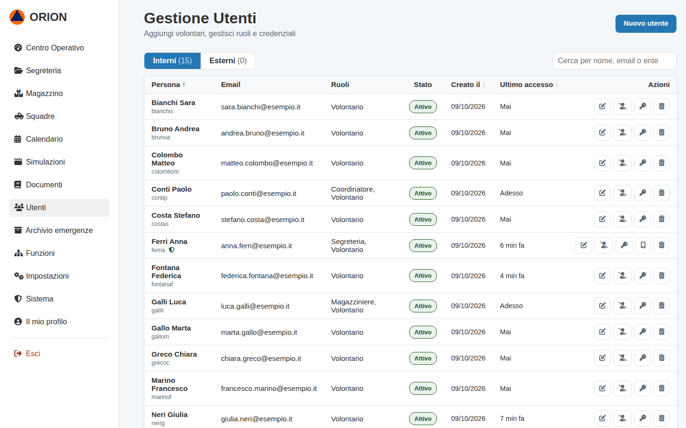

Le schede **Interni** ed **Esterni**, la ricerca e per ogni persona i ruoli, lo
stato, la data di creazione e l'ultimo accesso. Lo scudo verde accanto al nome
indica la verifica in due passaggi. I pulsanti sulla riga: modifica, sospendi
o riattiva, nuova password, azzera la verifica in due passaggi, elimina.
Sospendere toglie l'accesso e lascia tutto; eliminare cancella i dati
personali e tiene solo il nome dove serve allo storico.

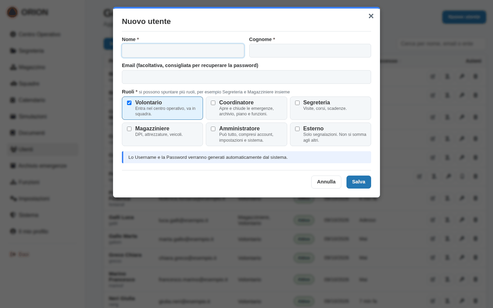

**Nuovo utente**: nome, cognome, email e ruoli. ORION crea il nome utente e il
link di attivazione, che si manda per email o si stampa sul foglio con il QR.
In fondo alla pagina **Importa da file** iscrive molti volontari da un foglio
Excel o CSV con le colonne Nome e Cognome (ed eventualmente Email, Telefono,
Codice fiscale).

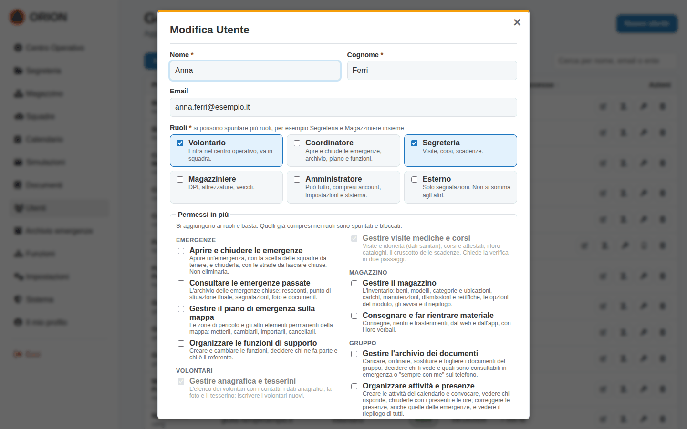

**Ruoli e permessi.** I ruoli sono pacchetti di permessi. Chi ha bisogno di un
solo compito riceve il permesso singolo in "Permessi in più", senza il ruolo
intero.

| Ruolo | Cosa può fare in più del volontario |
|---|---|
| Volontario | Centro operativo, rubrica, documenti, calendario, i propri dati |
| Coordinatore | Aprire e chiudere emergenze, archivio, piano sulla mappa, funzioni di supporto, organizzare attività |
| Segreteria | Anagrafica e tesserini, visite mediche e corsi |
| Magazziniere | Gestire il magazzino, consegnare e far rientrare materiale |
| Amministratore | Tutto, più account, impostazioni, backup e aggiornamenti |
| Esterno | Solo l'emergenza in corso |

Il permesso di gestire l'archivio dei documenti non è in nessun ruolo tranne
l'amministratore: si dà a chi tiene l'archivio.

## 12. L'archivio delle emergenze

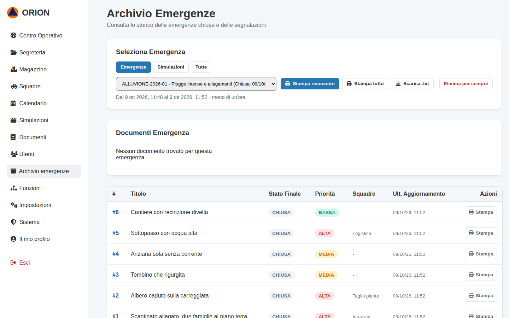

Si sceglie un'emergenza chiusa (o una simulazione) e si vedono le segnalazioni
con l'esito. **Stampa resoconto** prepara il riepilogo, **Stampa tutto**
aggiunge ogni segnalazione con diario e foto, **Scarica .txt** dà il testo.
"Elimina per sempre" toglie l'emergenza per fare spazio: nello storico resta
scritto chi l'ha fatto.

## 13. Le funzioni di supporto

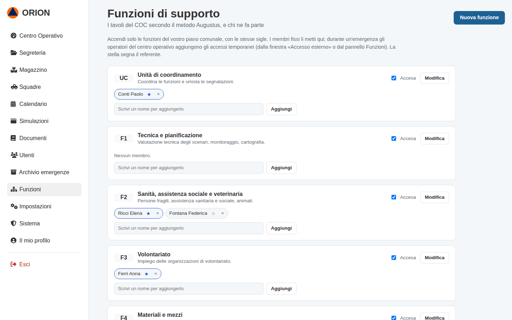

Le funzioni del piano comunale, dall'unità di coordinamento alla F9. Si tengono
accese solo quelle del vostro piano, si rinominano o se ne aggiungono altre.
Sotto ogni funzione si aggiungono i membri; la stella segna il referente.

## 14. Le impostazioni

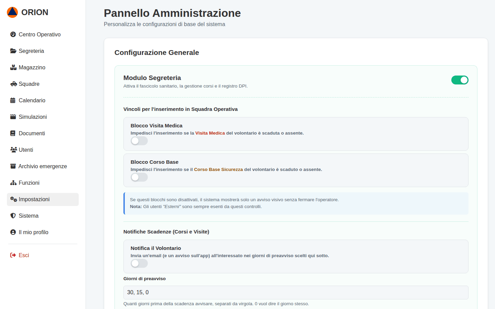

Si fanno una volta, all'inizio. In ordine:

| Sezione | Cosa si decide |
|---|---|
| Moduli | Segreteria (con i blocchi su visita e corso), Magazzino, Funzioni di supporto, Attività e calendario |
| Tesserino QR pubblico | Accendere o spegnere i QR dei volontari |
| App Android | Se l'app è a disposizione del personale |
| Nome e logo | Il nome dell'associazione e il logo |
| Tesserino | Distretto, ente, codice fiscale, logo; "Personalizza l'aspetto" apre il configuratore |
| Mappa | Il centro e lo zoom iniziali |
| Centro operativo | Dopo quanti minuti una segnalazione senza squadra diventa rossa |
| Bollettino di allerta | La Regione, il comune di riferimento e da che livello avvisare chi apre le emergenze |
| Posta | Il server della posta in uscita, con "Manda una prova" |
| Condizioni d'uso | Il testo da accettare e chi non l'ha ancora fatto |
| Livelli del piano | Zone di pericolo e aree importate da QGIS, cartografia per lavorare senza internet |
| Registro operazioni | Chi ha fatto cosa, con filtri |

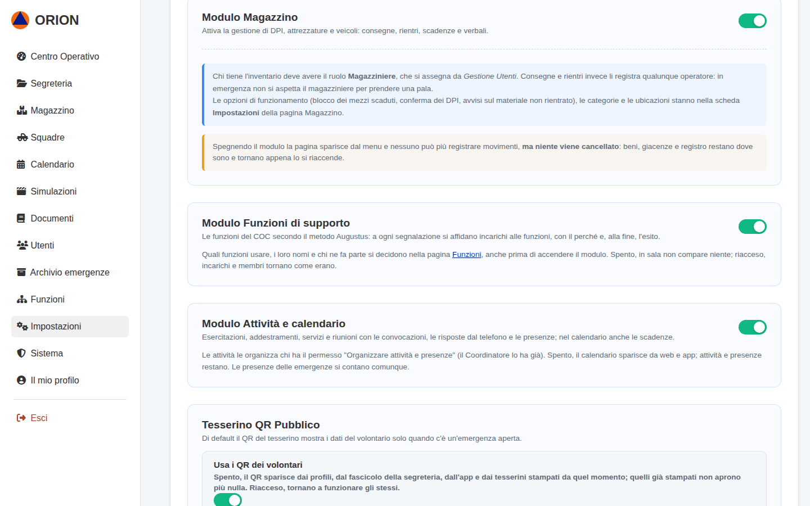

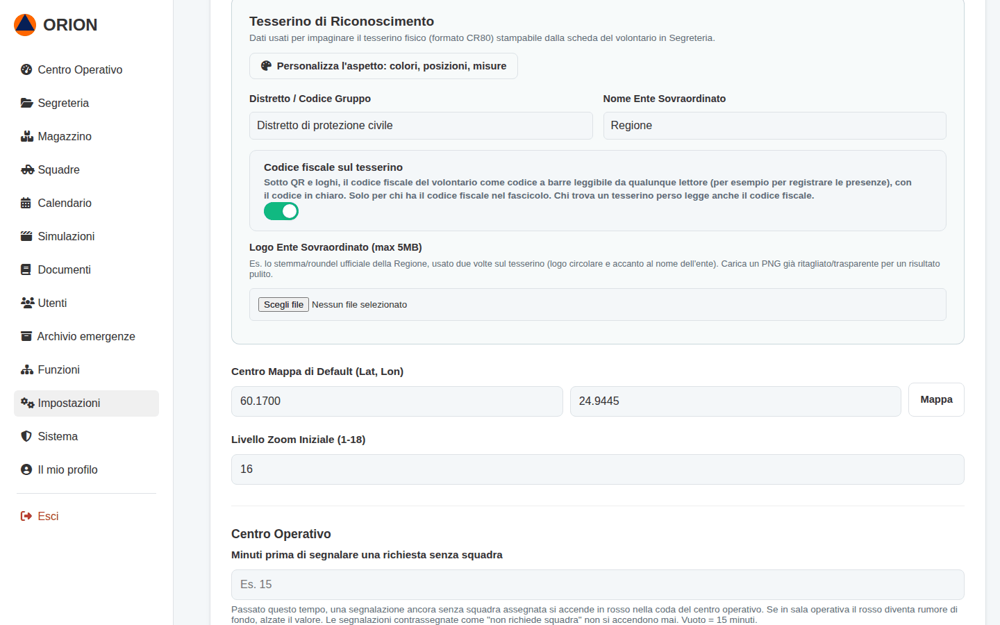

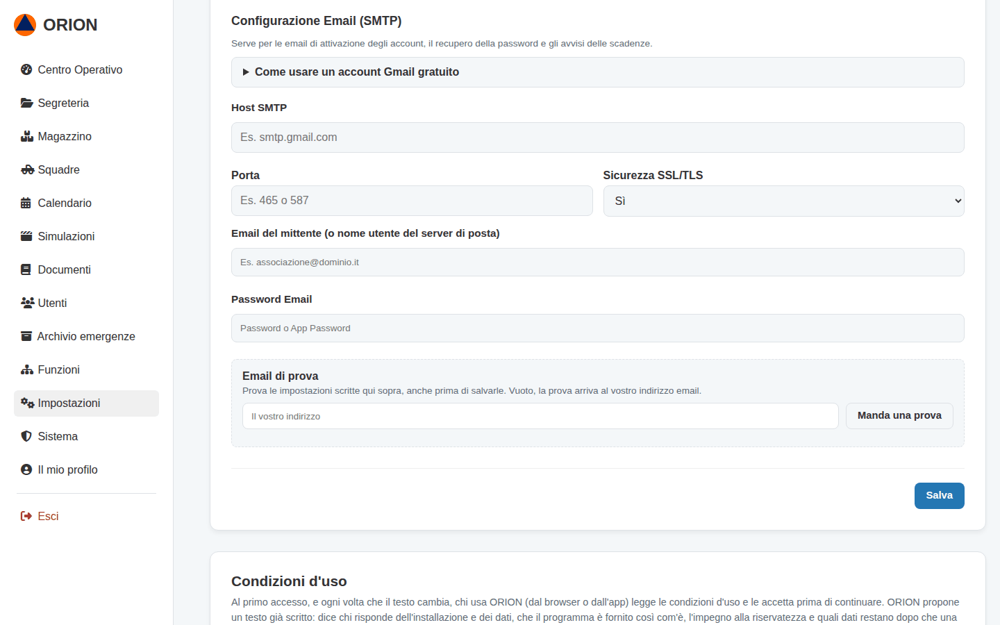

**La posta.** Con Gmail serve una "password per le app", creata da
myaccount.google.com/apppasswords con la verifica in due passaggi attiva.
Host smtp.gmail.com, porta 465, SSL/TLS sì. "Manda una prova" prova prima di
salvare e, se non va, dice perché.

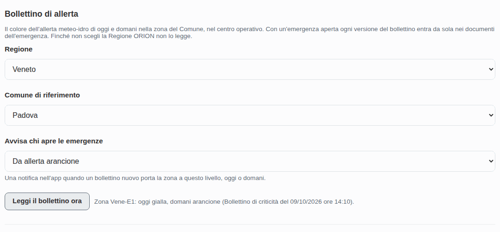

**Il bollettino di allerta.** Finché la Regione è "Spento" ORION non lo legge.
Scelta la Regione, la zona d'allerta si ricava dal **comune di riferimento**
oppure, lasciando "Dal centro della mappa", dal punto in cui è centrata la
mappa; sotto la scelta ORION dice in che zona cade. "Avvisa chi apre le
emergenze" manda una notifica nell'app quando un bollettino nuovo porta la
zona a quel livello, oggi o domani. "Leggi il bollettino ora" salva la scelta,
scarica subito il bollettino e mostra cosa ha trovato. Per ora è disponibile
il Veneto; le altre Regioni si aggiungono senza cambiare il resto.

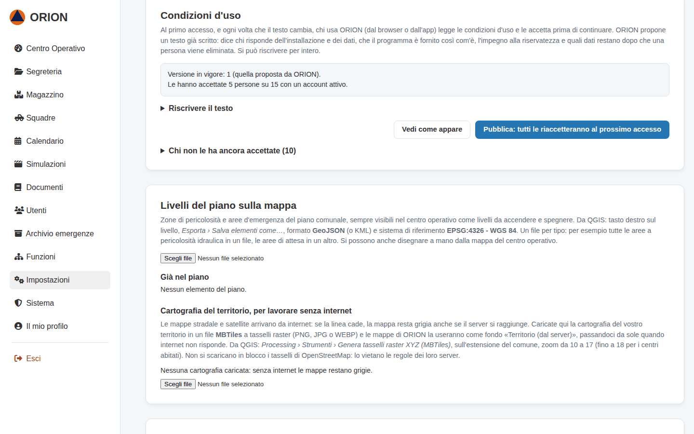

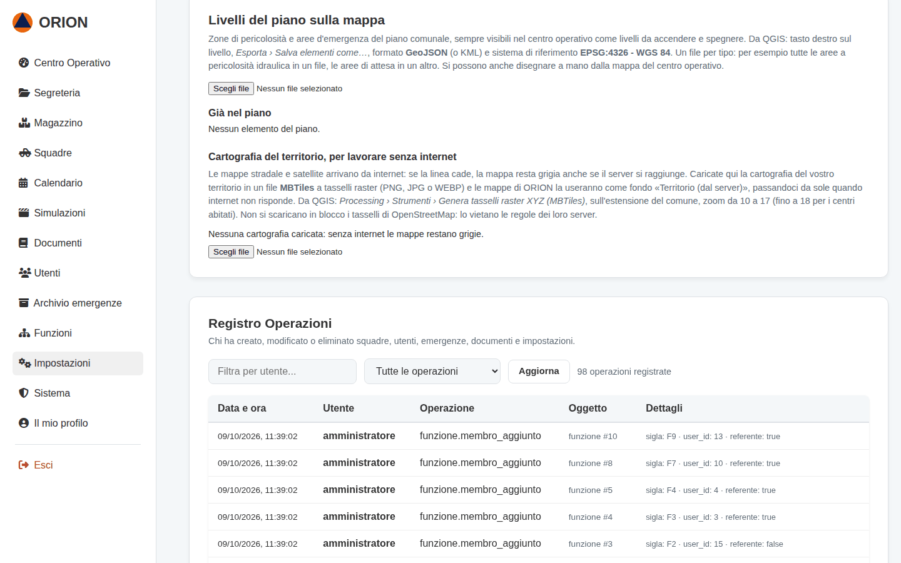

**Livelli del piano.** Le zone si esportano da QGIS in GeoJSON (o KML) con
sistema EPSG:4326; ORION chiede cosa rappresentano e quale campo contiene nome
e livello. La **cartografia del territorio** è un file MBTiles a tasselli
raster (preparato con QGIS): con quella la mappa funziona anche senza internet.

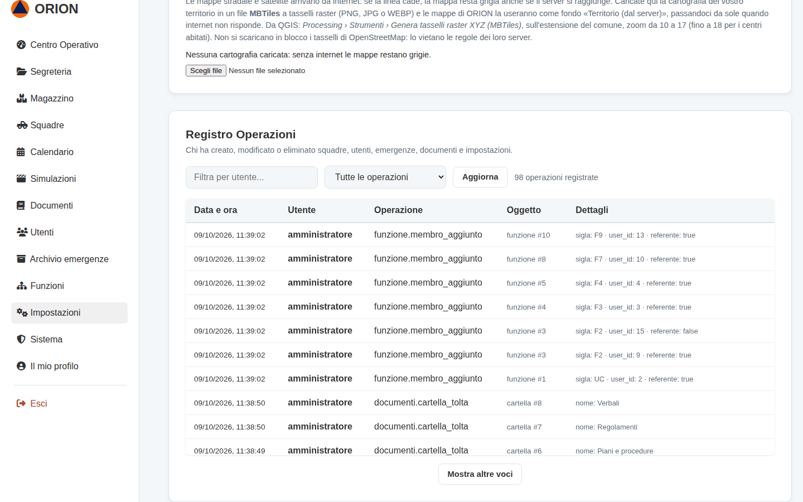

## 15. Il sistema

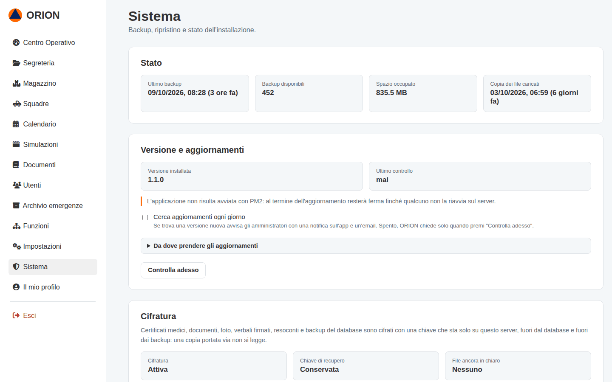

In alto lo stato: ultimo backup, backup disponibili, spazio, ultima copia
scaricata. Poi la versione e gli aggiornamenti: "Controlla adesso" dice se c'è
una versione nuova e la installa. Con un'emergenza aperta non si aggiorna.

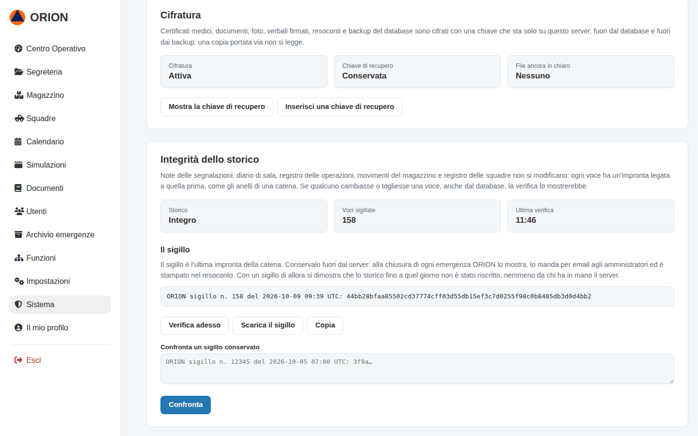

**Cifratura.** Certificati, documenti, foto e backup sono cifrati con una
chiave che sta sul server. "Mostra la chiave di recupero" la fa vedere: va
stampata e conservata fuori dal server. Senza, se il server si rompe i dati
cifrati non si recuperano.

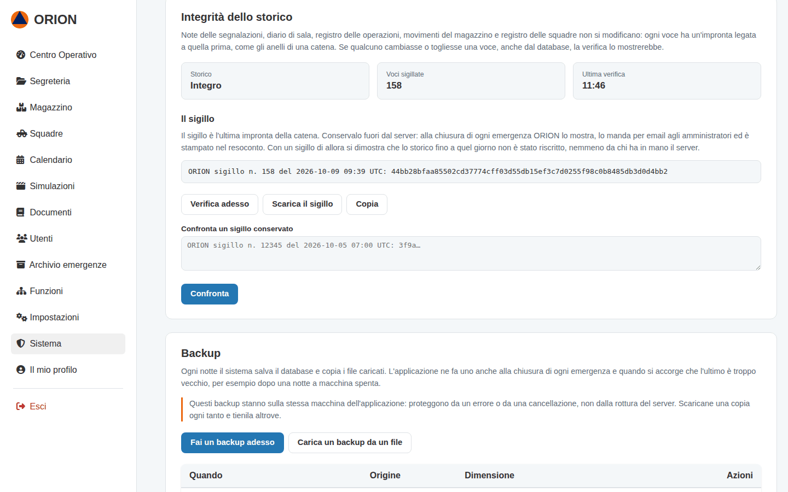

**Integrità dello storico.** Note, diario, registro e movimenti non si
cancellano e sono legati in una catena: "Verifica adesso" controlla che
nessuno li abbia toccati. Il **sigillo** è l'impronta della catena: si
scarica, si conserva fuori dal server e si confronta in seguito.

**Notifiche Firebase.** Facoltative. Di base l'app riceve gli avvisi restando
in ascolto del server, con la notifica fissa "Avvisi attivi" sul telefono. Chi
vuole avvisi più puntuali, anche sui telefoni che chiudono le app da soli,
crea un progetto Firebase dell'associazione seguendo la guida del riquadro
(circa un quarto d'ora, una volta sola), carica `google-services.json` e la
chiave dell'account di servizio e preme **Attiva**. ORION controlla con
Google che la chiave funzioni prima di salvarla. Da lì i telefoni passano a
Firebase la prossima volta che si collegano; quelli senza Google Play restano
come prima. A Google non va il contenuto delle notifiche, solo un segnale
vuoto. Il riquadro dice quanti telefoni sono registrati e quando è partito
l'ultimo segnale; **Manda una prova al mio telefono** e **Spegni Firebase**
fanno quello che dicono. Spento Firebase, i telefoni tornano da soli al
collegamento di sempre.

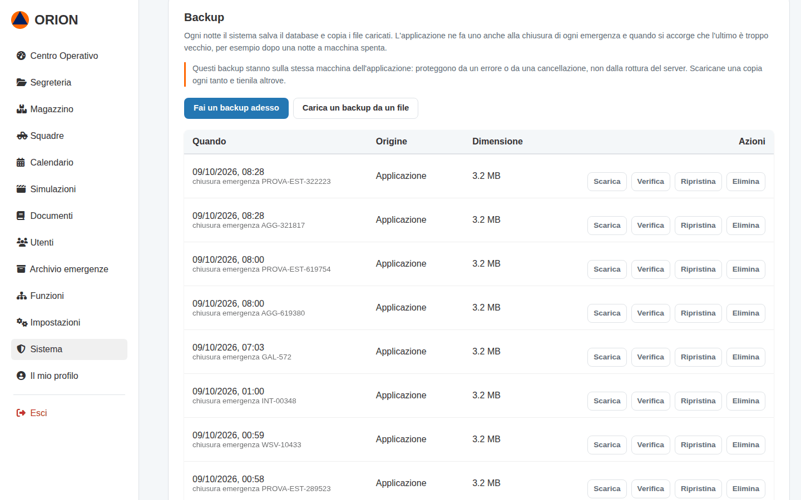

**Backup.** Il server ne fa uno ogni notte e ORION uno a ogni chiusura
d'emergenza. "Fai
un backup adesso", Scarica, Verifica, Ripristina. Il ripristino chiede la
password e la parola RIPRISTINA, e prima salva i dati attuali. Ogni tanto va
scaricata una copia e tenuta altrove.

**Tornare a una versione precedente.** Se un aggiornamento dà problemi, nel
riquadro della versione c'è l'elenco delle versioni lasciate, una per riga.
**Torna a questa** chiede la password e la parola TORNA. Di base i dati
restano quelli di adesso: si tolgono solo le parti del database aggiunte dalle
versioni successive, e la finestra dice quali. Con **Riporta anche i dati a
com'erano** si torna anche ai dati del momento dell'aggiornamento: quello che
è stato fatto dopo sparisce (resta nel backup fatto prima di tornare
indietro). Per tornare
avanti basta aggiornare di nuovo. Con un'emergenza aperta non si può.

## 16. Quando qualcosa non va

| Cosa succede | Cosa fare |
|---|---|
| La password non va | "Hai dimenticato la password?" o un link nuovo dall'amministratore |
| Il codice a sei cifre viene rifiutato | L'ora del telefono deve essere automatica; altrimenti un codice di riserva |
| Telefono e codici di riserva persi | L'amministratore azzera la verifica dalla pagina Utenti |
| Una voce del menu non c'è | Non è del tuo ruolo, o il modulo è spento |
| Fascia rossa "Il server non risponde" | Non ricaricare: si lavora e la coda parte da sola |
| La mappa è grigia | Manca internet: si passa al fondo "Territorio (dal server)" se c'è |
| Una squadra non compare sulla mappa | Il telefono non ha la posizione "sempre" o la persona non è in squadra |
| Le email non partono | "Manda una prova" nelle impostazioni della posta dice il motivo |
| Firebase non si attiva | Il messaggio dice quale file non va: i due file devono essere dello stesso progetto, e nel progetto deve esserci l'app `it.orion.app` |
